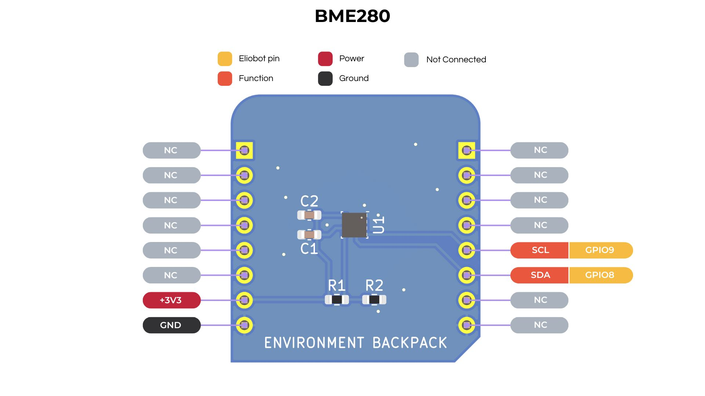

## Documentation du Capteur BME280

---

### 1. **Introduction**

Le BME280 est un capteur de haute précision qui mesure la température, l'humidité et la pression atmosphérique.
Il est couramment utilisé dans la surveillance environnementale, les stations météorologiques en raison de sa fiabilité.
Le capteur communique via l'interface I2C.

---

### 2. **Caractéristiques Techniques**

- **Plage de Température** : -40 à 85 °C (précision de ±1.0°C)
- **Plage d'Humidité** : 0% à 100% HR (précision de ±3% HR)
- **Plage de Pression** : 300 à 1100 hPa (précision de ±1 hPa)
- **Tension de Fonctionnement** : 1,8V à 3,6V
- **Interface** : I2C (par défaut) ou SPI
- **Dimensions** : 2,5 mm x 2,5 mm x 0,93 mm
- **Consommation d'Énergie** : 0,1 µA en mode veille, 1,8 µA à une fréquence d'échantillonnage de 1 Hz

---

### 3. **Configuration des Broches**



---

### 4. **Utilisation du BME280 avec CircuitPython**

**Installation de la Bibliothèque** :

1. La bibliothèque s'installe automatiquement si vous utilisez un bloc de code qui utilise le sac à dos DHT11 dans Elioblocs.

2. Sinon Installez la bibliothèque `Adafruit CircuitPython BME280` en utilisant le Bundle de Bibliothèques [CircuitPython d'Adafruit](https://circuitpython.org/libraries).

**Exemple de Code** :

```python
import time
import board
import adafruit_bme280

# Initialisation du capteur BME280
i2c = busio.I2C(board.IO9, board.IO8)
bme280 = adafruit_bme280.Adafruit_BME280_I2C(i2c, address=0x76)

# Optionnellement, réglez la pression au niveau de la mer en fonction de votre localisation
bme280.sea_level_pressure = 1013.25

while True:
    print(f"Température: {bme280.temperature:.1f} °C")
    print(f"Humidité: {bme280.humidity:.1f} %")
    print(f"Pression: {bme280.pressure:.1f} hPa")
    print(f"Altitude: {bme280.altitude:.2f} mètres")

    time.sleep(2.0)
```

**Notes** :

- La variable `sea_level_pressure` peut être ajustée en fonction de votre localisation pour des lectures d'altitude plus précises.

---

### 5. **Applications Courantes**

- Stations météorologiques
- Surveillance environnementale
- Altimètres
- Dispositifs IoT pour la surveillance du climat et de la qualité de l'air