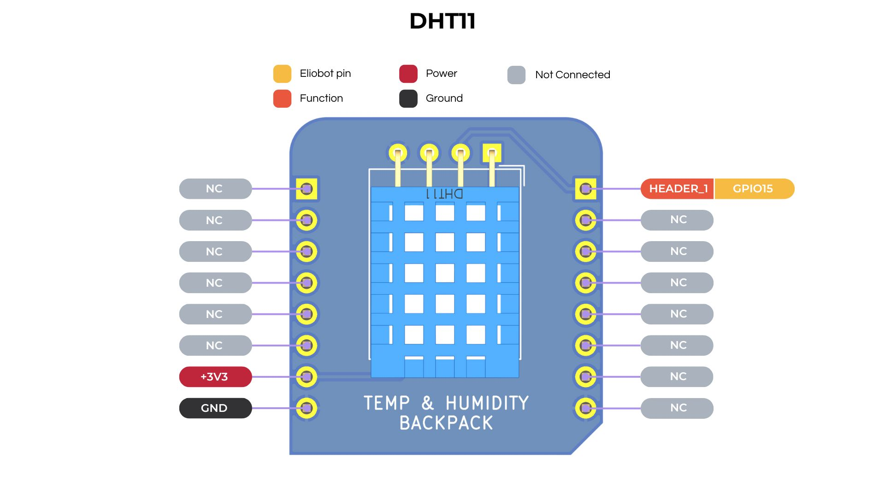

## Capteur DHT11 Documentation

---

### 1. **Introduction**

Le DHT11 est un capteur numérique de température et d'humidité largement utilisé dans les projets de surveillance environnementale.
Il fournit des relevés de température et d'humidité avec une précision modérée et est facile à utiliser.

---

### 2. **Caractéristiques Techniques**

- **Plage de Température** : 0 à 50 °C (précision de ±2°C)
- **Plage d'Humidité** : 20% à 90% HR (précision de ±5% HR)
- **Tension de Fonctionnement** : 3V à 5.5V
- **Interface** : Numérique (monofil)
- **Temps de Réponse** : 1 seconde
- **Dimensions** : 15,5 mm x 12 mm x 5,5 mm
- **Durée de Vie** : Plus de 20 000 cycles de mesure

---

### 3. **Configuration des Broches**



---

### 4. **Utilisation du DHT11 avec CircuitPython**

**Installation de la Bibliothèque** :

1. La bibliothèque s'installe automatiquement si vous utilisez un bloc de code qui utilise le sac à dos DHT11 dans Elioblocs.

2. Sinon Installez la bibliothèque `Adafruit CircuitPython DHT` en utilisant le Bundle de Bibliothèques [CircuitPython d'Adafruit](https://circuitpython.org/libraries).

**Exemple de Code** :

```python
import time
import board
import adafruit_dht

# Initialisation du capteur DHT11
dht11 = adafruit_dht.DHT11(board.IO15)

while True:
    temperature = dht11.temperature
    humidity = dht11.humidity
    
    print(f"Temp: {temperature} °C    Humidité: {humidity} %")
    time.sleep(2.0)
```

- `time.sleep(2.0)` assure que le capteur est lu toutes les 2 secondes, ce qui est recommandé pour des relevés fiables.

---

### 5. **Applications Courantes**

- Stations météorologiques domestiques
- Systèmes de contrôle de l'humidité
- Projets d'automatisation domestique
- Dispositifs IoT pour la surveillance environnementale