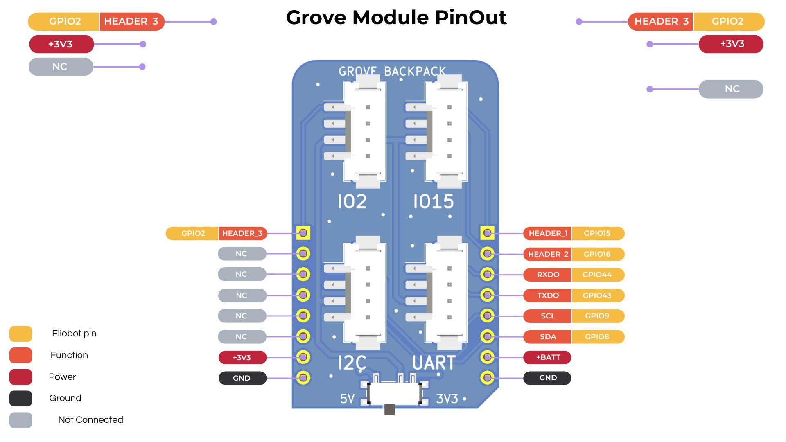

## Documentation du Backpack Module Grove

---

### 1. **Introduction**

Le backpack Module Grove est un module d'extension qui permet de connecter des capteurs et des actionneurs Grove à Elioblocs.


---

### 2. **Caractéristiques Techniques**

- **Nombre de Ports** : 4
- **Type de Ports** : Grove
- **Tension de Fonctionnement** : 3,3V à 5V
- **Interface** : I2C, UART, Analogique, Numérique

---

### 3. **Configuration des Broches**



---

### 4. **Utilisation de Module Grove avec CircuitPython**

**Installation de la Bibliothèque** :

1. Aucune installation de bibliothèque n'est requise pour utiliser le backpack Module Grove dans Elioblocs.

**Exemple de Code Avec un Bouton Grove** :

```python
import board
import digitalio
import neopixel
import time

button = digitalio.DigitalInOut(board.IO2)
button.direction = digitalio.Direction.INPUT

# Built in Neopixel declaration
pixels = neopixel.NeoPixel(board.NEOPIXEL, 1, brightness=0.2, auto_write=False, pixel_order=neopixel.GRB)


while True:
    if button.value:
        pixels.fill((255, 0, 0))
        pixels.show()
        time.sleep(1)

    else:
        pixels.fill((0, 0, 0))
        pixels.show()

```

---