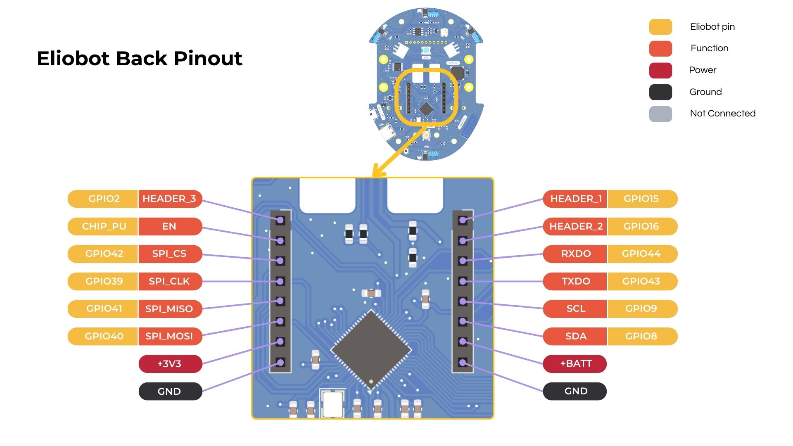

Les backpacks d'Eliobot sont des modules qui permettent d'ajouter des fonctionnalités à Eliobot.
Il en existe plusieurs, chacun ayant une fonctionnalité spécifique.

## Utilisation avec Elioblocs

Tous les blocs associés aux backpacks sont regroupés dans la catégorie .

## Utilisation avec Python

Chaque backpack utilise un ou plusieurs pins pour fonctionner et peut utiliser des protocoles de communication différents.
Tu peux retrouver la documentation de ton backpack dans la liste ci-dessous.

## Configuration des Broches

Chaque backpack a une configuration de broches spécifique. Tu peux retrouver la configuration des broches de ton backpack dans la documentation associée.



## Liste des Backpacks

```mdx-code-block
import DocCardList from '@theme/DocCardList';

<DocCardList/>
```