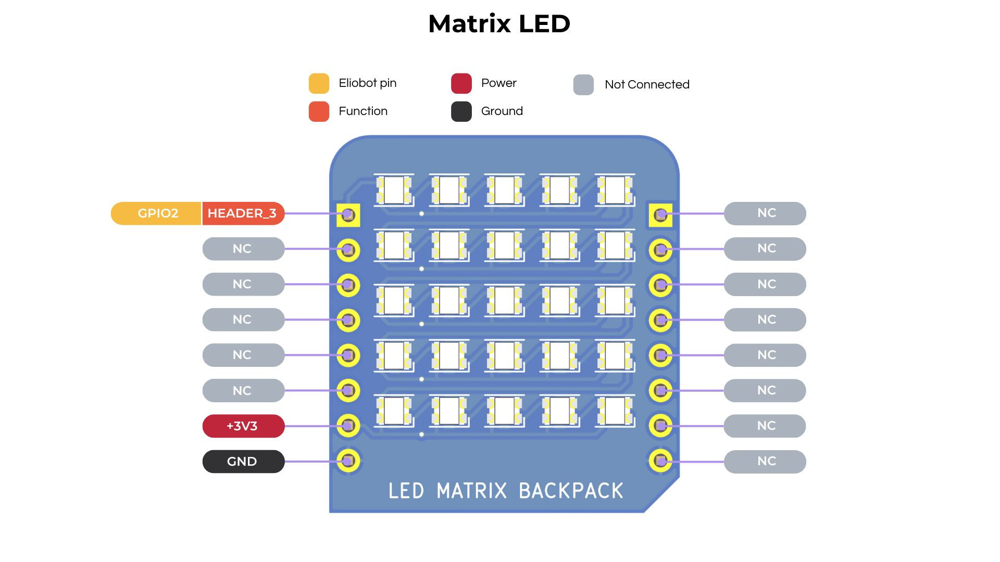

## Documentation de la Matrice de LED NeoPixel 5x5

---

### 1. **Introduction**

La matrice de LED NeoPixel 5x5 est un affichage polyvalent et coloré pouvant être contrôlé par une seule broche de données.
Chaque LED de la matrice est une LED RVB, permettant des millions de combinaisons de couleurs.
Cette matrice est couramment utilisée dans des projets d'éclairage créatifs, des affichages et des installations interactives.

---

### 2. **Caractéristiques Techniques**

- **Nombre de LEDs** : 25 (matrice 5x5)
- **Tension de Fonctionnement** : 3,3V DC
- **Protocole de Données** : Communication monofil (WS2812 ou WS2812B)
- **Consommation de Courant** : Jusqu'à 60mA par LED à luminosité maximale (toutes les LEDs en blanc)
- **Dimensions** : Environ 50mm x 50mm (varie selon le fabricant)
- **Ordre des Couleurs des Pixels** : GRB (Vert-Rouge-Bleu) ou RVB selon le modèle

---

### 3. **Configuration des Broches**



---

### 4. **Utilisation de la Matrice NeoPixel avec CircuitPython**

**Installation de la Bibliothèque** :

1. La bibliothèque s'installe automatiquement si vous utilisez un bloc de code qui utilise le sac à dos Matrice de Led dans Elioblocs.

2. Sinon, installez la bibliothèque `matrix.py` sur notre [dépôt GitHub](https://github.com/Eliobot/elio-backpacks/tree/main/matrix-led/Python/library).

**Exemple de Code** :

```python
import board
from matrix import MatrixLED
import time

matrix = MatrixLED(board.IO2)

while True:
    # Fait défiler le texte "SUPER" en vert
    matrix.scroll_matrix_text('SUPER', (153, 153, 0))

```

---