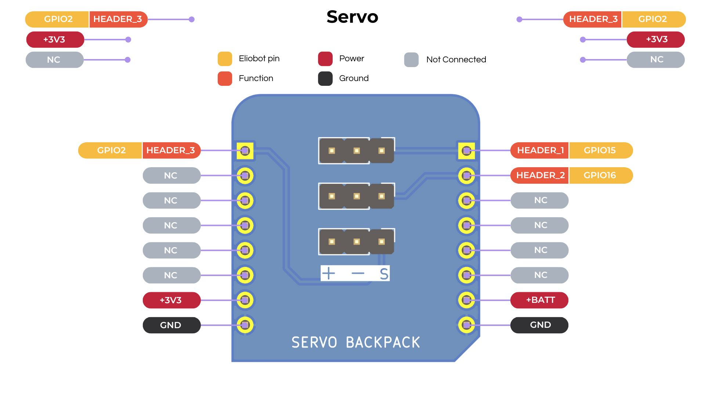

## Documentation du Backpack Servomoteur

---

### 1. **Introduction**

Le backpack Servomoteur est un module d'extension qui permet de contrôler jusqu'à trois servomoteurs sur trois broches de sortie distinctes.
Les servomoteurs sont des actionneurs rotatifs qui peuvent être utilisés pour contrôler la position angulaire d'un axe.
Ils sont couramment utilisés dans les projets de robotique, de modélisme et d'automatisation.

---

### 2. **Caractéristiques Techniques**

- **Nombre de Servomoteurs** : 3
- **Tension de Fonctionnement** : 3,3V à 5V
- **Interface** : PWM (Pulse Width Modulation)
- **Plage de Rotation** : 0 à 180 degrés

---

### 3. **Configuration des Broches**



---

### 4. **Utilisation de Servomoteur avec CircuitPython**

**Installation de la Bibliothèque** :

1. Aucune installation de bibliothèque n'est requise pour utiliser le backpack Servomoteur dans Elioblocs.

**Exemple de Code** :

```python
import board
import pwmio
import time

pwm = pwmio.PWMOut(board.IO15, frequency=50)


while True:
    pwm.duty_cycle = int(((90 / 180.0) * (2750 - 750) + 750) * pwm.frequency * 65535 / 1000000)
    time.sleep(1)

    pwm.duty_cycle = int(((0 / 180.0) * (2750 - 750) + 750) * pwm.frequency * 65535 / 1000000)
    time.sleep(1)
```

---