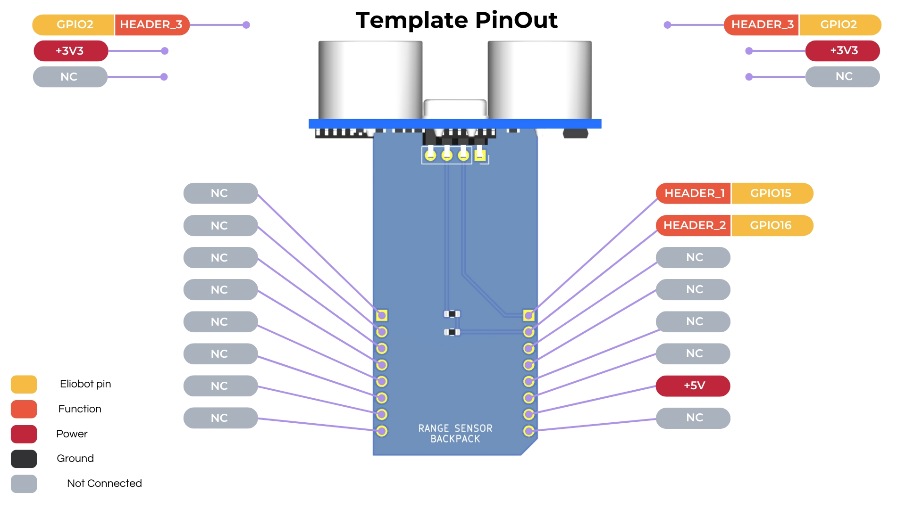

## Documentation du Capteur Ultrasonique

---

### 1. **Introduction**

Un capteur ultrasonique est un dispositif qui utilise des ondes sonores pour mesurer la distance d'un objet.
Il émet une onde sonore à une fréquence spécifique (généralement 40 kHz), puis écoute le retour de cette onde.
En calculant le temps nécessaire pour que l'écho revienne, le capteur peut déterminer la distance de l'objet.
Les capteurs ultrasoniques sont couramment utilisés en robotique, en automatisation et pour la détection d'obstacles.

---

### 2. **Caractéristiques Techniques**

- **Tension de Fonctionnement** : 5V DC
- **Courant de Fonctionnement** : 15mA
- **Fréquence** : 40 kHz
- **Portée Maximale** : Typiquement 4 mètres
- **Portée Minimale** : Typiquement 2 cm
- **Dimensions** : Varie selon le modèle (e.g., HC-SR04 : 45mm x 20mm x 15mm)

---

#### 3. **Configuration des Broches**



---

### 3. **Utilisation du Capteur Ultrasonique avec CircuitPython**

**Exemple de Code** :

```python
import time
import board
from digitalio import DigitalInOut, Direction
import pulseio

trigger = DigitalInOut(board.IO15)
trigger.direction = Direction.OUTPUT
trigger.value = False

echo = pulseio.PulseIn(board.IO16)
echo.pause()
echo.clear()

def measure_distance():
    trigger.value = True
    time.sleep(0.00001)
    trigger.value = False

    echo.clear()
    echo.resume()

    start = time.monotonic()
    while len(echo) == 0:
        if time.monotonic() - start > 0.2:
            echo.pause()
            return None

    echo.pause()
    duration = echo[0] / 1000000  # Convertir à des secondes
    distance = (duration * 34300) / 2
    return distance


while True:
    time.sleep(1)

    print(measure_distance())
```

**Notes** :

- La fonction `measure_distance()` envoie une impulsion et mesure le temps pris pour que l'écho revienne.
- La vitesse du son est utilisée pour calculer la distance en centimètres.

---

#### 4. **Applications Courantes**

- Évitement d'obstacles pour robots
- Mesure de distance pour les systèmes d'automatisation
- Systèmes d'assistance au stationnement
- Mesure du niveau de liquide
- Capteurs de proximité dans les systèmes de sécurité