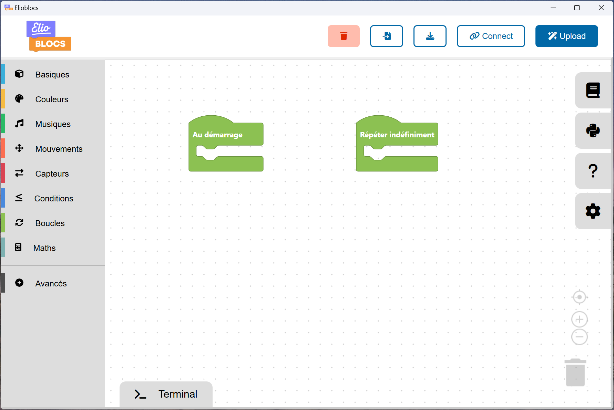
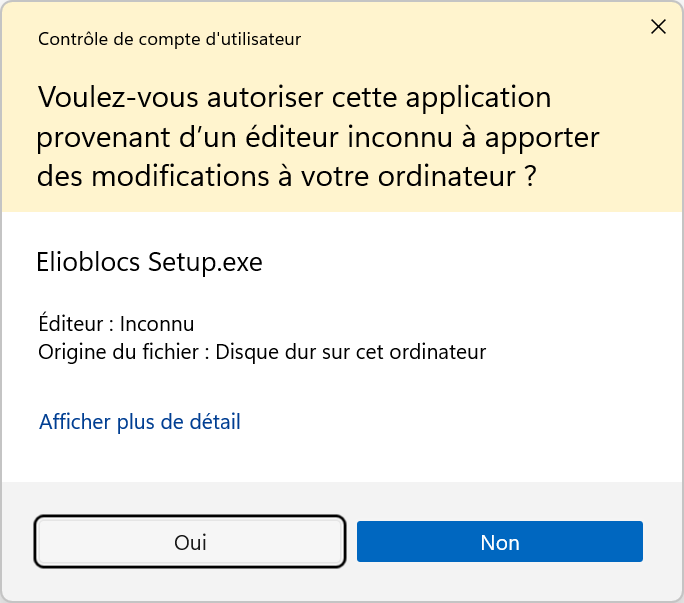
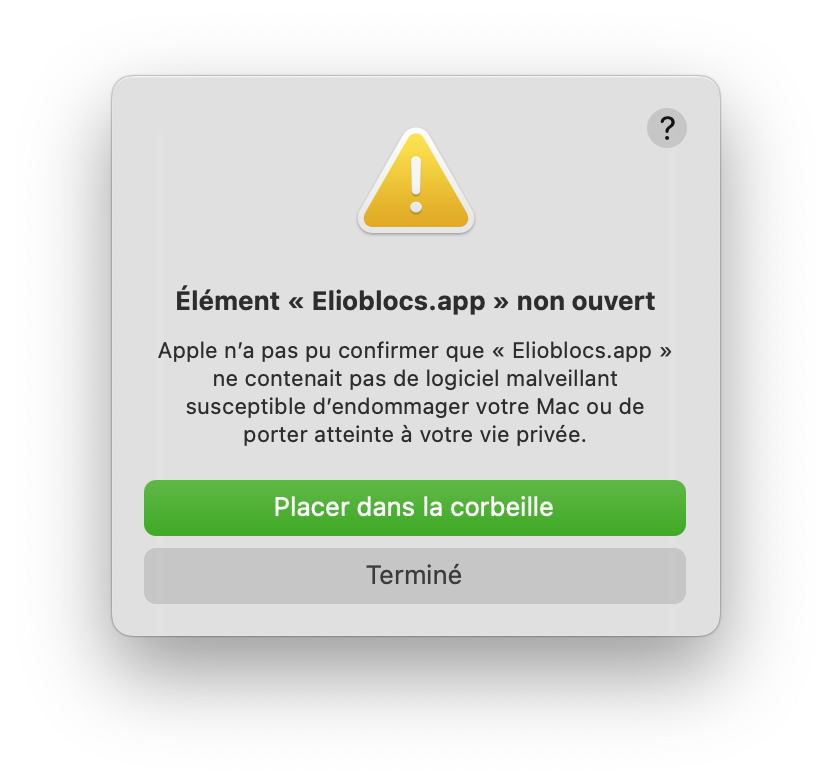
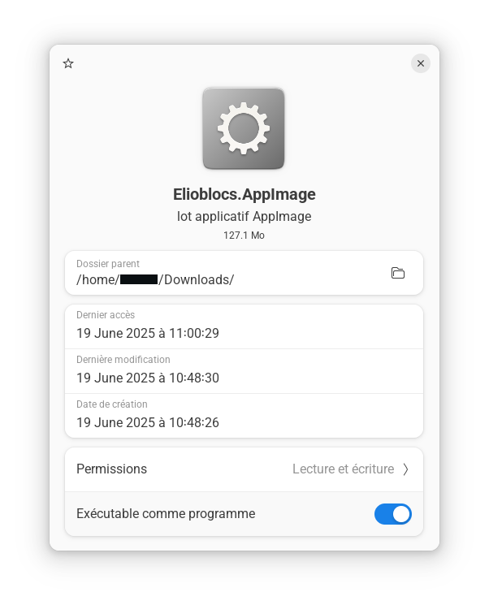

# Application Elioblocs pour PC

Elioblocs est aussi disponible en application pour **Windows**, **macOS** et **Linux**.

:::warning
Je te conseille d'utiliser l'application web Elioblocs disponible sur [app.eliobot.com](https://app.eliobot.com) pour une expérience optimale.
L'application PC est principalement destinée aux utilisateurs qui souhaitent travailler hors ligne ou qui rencontrent des problèmes de connexion avec l'application web.
:::



---

## Télécharger l'application

Choisis ton système d'exploitation :

[](https://app.eliobot.com/desktop/windows/Elioblocs%20Setup.exe)  
[-black?style=for-the-badge&logo=apple)](https://app.eliobot.com/desktop/mac/Elioblocs-arm64.dmg)  
[-black?style=for-the-badge&logo=apple)](https://app.eliobot.com/desktop/mac/Elioblocs.dmg)  
[](https://app.eliobot.com/desktop/linux/Elioblocs.AppImage)  
[-orange?style=for-the-badge&logo=linux)](https://app.eliobot.com/desktop/linux/Elioblocs-arm64.AppImage)

:::tip Tu ne sais pas lequel choisir ?

- **Windows** : clique sur le bouton bleu.
- **macOS** :
  - Mac récent (depuis 2020) → **Apple Silicon**
  - Mac plus ancien → **Intel**
- **Linux** :
  - Processeur Intel ou AMD (PC Fixe et Portable) → **Linux**
  - Processeur ARM (Raspberry Pi, Chromebook, etc.) → **Linux (ARM64)**
:::

---

## Installation sur Windows

1. Télécharge le fichier `Elioblocs Setup.exe` via le bouton ci-dessus.
2. Ouvre le fichier téléchargé.
3. Clique sur **"Oui"** si Windows te demande une autorisation.



4. Suis les étapes de l'installation. Les options par défaut conviennent généralement.
5. Une fois installé, lance Elioblocs depuis le menu Démarrer ou le raccourci sur le bureau.

---

## Installation sur macOS

1. Télécharge le fichier `.dmg` adapté à ton Mac.
2. Ouvre le fichier pour monter l’image disque.
3. Glisse l’icône **Elioblocs** dans le dossier **Applications**.
4. Autorise l'application via le terminal :

   ```bash
   xattr -rc com.apple.quarantine "/Applications/Elioblocs.app"
   ```

:::warning
Si tu ne fais pas cette étape, tu auras un message d'erreur au lancement.  
Pas d’inquiétude, c’est une sécurité standard de macOS pour les applications non vérifiées.


:::

5. Lance Elioblocs depuis le dossier **Applications** ou via Spotlight.

---

## Installation sur Linux

1. Télécharge le fichier `.AppImage` adapté à ton système.
2. Déplace le fichier téléchargé dans un dossier de ton choix (par exemple, le bureau ou un dossier spécifique par exemple `~/Applications`).
3. Ouvre un terminal et navigue jusqu'au dossier où tu as déplacé le fichier.
4. Rends le fichier exécutable avec la commande :

   ```bash
   chmod +x Elioblocs.AppImage
   ```

   ou pour ARM64 :

   ```bash
    chmod +x Elioblocs-arm64.AppImage
   ```

   Tu peux aussi faire un clic droit sur le fichier, sélectionner "Propriétés", puis cocher la case `Executable comme un programme`.
   

5. Lance l'application avec la commande :

   ```bash
   ./Elioblocs.AppImage
   ```

    ou pour ARM64 :

   ```bash
   ./Elioblocs-arm64.AppImage
   ```

   Tu peux aussi double-cliquer sur le fichier pour l'ouvrir.

   :::warning
   Sur certaines distributions Linux, tu pourrais avoir besoin d'installer des dépendances supplémentaires pour que l'application fonctionne correctement. Consulte la documentation de ta distribution pour plus d'informations.
   :::

   :::tip
   Si tu souhaites que l'application soit accessible depuis le menu des applications, tu peux créer un fichier `.desktop` dans le dossier `~/.local/share/applications/`, je te conseille de suivre un tutoriel spécifique à ta distribution pour cela.
   :::

## Mise à jour de l'application

Pour mettre à jour Elioblocs, il te suffit de télécharger la dernière version depuis le site officiel et de suivre à nouveau le processus d'installation.
Si tu as déjà installé Elioblocs, l'installateur remplacera automatiquement l'ancienne version par la nouvelle.