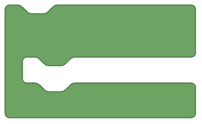

Sur Elioblocs, il existe trois grande catégories de blocs : 
- Les blocs booléens
- Les blocs de valeurs
- Les blocs de commandes

## Les blocs booléens

Les blocs booléens permettent de réaliser des tests et des comparaisons. Ils renvoient `vrai` ou `faux`.
Ils sont représentés par des blocs en forme de losange.


## Les blocs de valeurs

Les blocs de valeurs permettent de manipuler des nombres, des textes et des listes.
Ils sont représentés par des blocs en forme de ovale horizontal.


## Les blocs de commandes

Les blocs de commandes permettent de réaliser des actions. Ils sont représentés par des blocs en forme de rectangle sous différente manière.




## Les Catégories


```mdx-code-block
import DocCardList from '@theme/DocCardList';

<DocCardList />
```