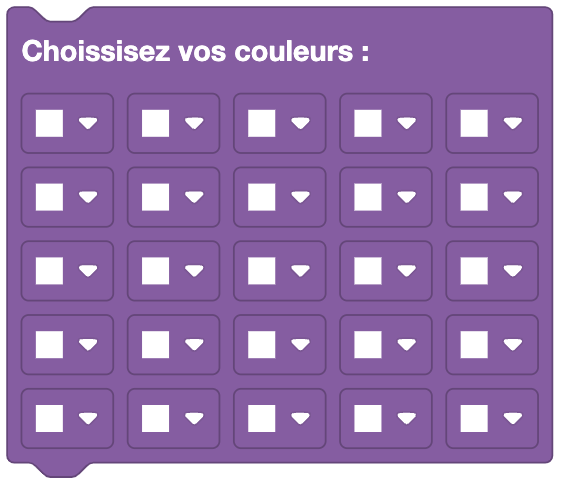
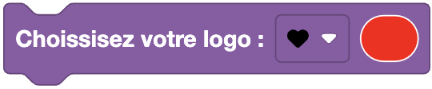
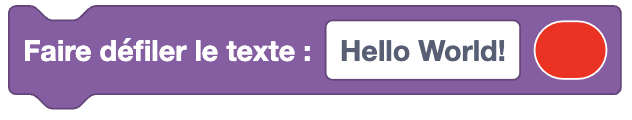

Les blocs de Sac à dos permettent de contrôler les accessoires d'Eliobot.

## Récupérer la valeur de température

## Récupérer la valeur d'humidité

## Choisir les couleurs d'une matrice de LED

## Effacer les couleurs d'une matrice de LED

## Choisir un logo à afficher sur une matrice de LED

## Faire défiler un texte sur une matrice de LED

