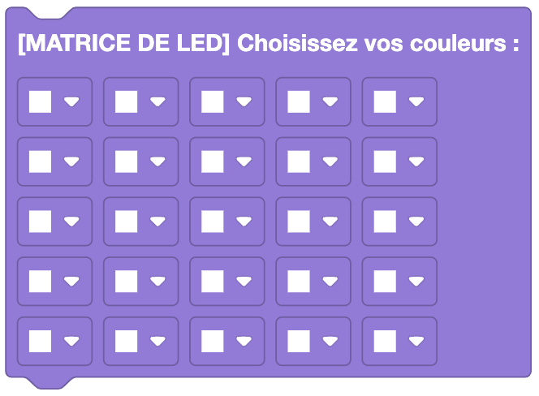
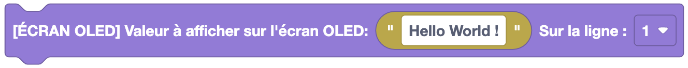
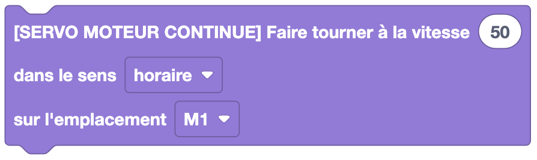

Les blocs Backpacks permettent de contrôler les accessoires d'Eliobot.

## TORTUE DE BOUTONS

:::warning
Attention pour être utilisé, Eliobot doit être équipé du backpack tortue de boutons.
:::

### Programmer avec des boutons

**Type** : Commande

**Définition** :

Ce bloc permet d'utiliser le backpack boutons tortue pour controler Eliobot.
On enregistre les actions à réaliser (avancer, reculer, tourner à gauche, tourner à droite) pour chaque bouton.
Puis une fois la séquence enregistrée, on peut la jouer en appuyant sur le bouton central.

**Utilisation** :

Pour faire programmer Eliobot au plus jeune, en utilisant des boutons pour lui donner des instructions.

## CAPTEUR DHT11

:::warning
Attention pour être utilisé, Eliobot doit être équipé du backpack capteur d'humidité et de la librairie Adafruit DHT.
:::

### Récupérer la valeur de température ou d'humidité

**Type** : Valeur

**Définition** :

Ce bloc permet de récupérer la valeur de température ou d'humidité mesurée par le capteur DHT11.

**Utilisation** :

Si tu veux récupérer la température ou l'humidité mesurée par le capteur pour l'utiliser dans ton programme. Par exemple, pour afficher la température dans le terminal.

## MATRICE DE LED

:::warning
Attention pour être utilisé, Eliobot doit être équipé du backpack matrice de LED.
:::

### Choisir les couleurs d'une matrice de LED

**Type** : Commande

**Définition** :

Ce bloc permet de choisir les couleurs d'une matrice de LED. Il te permet de dessiner ce que tu veux sur une matrice 5x5 de LED avec les couleurs RGB. Remarque : le noir correspond à une LED éteinte.

**Utilisation** :

Si tu veux dessiner un logo ou un message sur une matrice de LED. Par exemple, pour afficher une information en fonction des résultats de tes capteurs.

### Effacer les couleurs d'une matrice de LED

**Type** : Commande

**Définition** :

Ce bloc permet d'effacer les couleurs d'une matrice de LED. Il te permet de réinitialiser une matrice 5x5 de LED avec toutes les LED éteintes.

**Utilisation** :

Si tu veux effacer ce qui est affiché sur une matrice de LED. Par exemple, pour effacer un message ou un logo.

### Choisir un logo à afficher sur une matrice de LED

**Type** : Commande

**Définition** :

Ce bloc permet de choisir un logo à afficher sur une matrice de LED :
- Cœur
- Smiley heureux
- Smiley triste
- Flèche haut
- Flèche bas
- Flèche gauche
- Flèche droite
- Croix
- Check

**Utilisation** :

Si tu veux afficher un logo sur une matrice de LED. Par exemple, pour indiquer la direction que prend Eliobot ou si un obstacle est détecté.

### Faire défiler un texte sur une matrice de LED

**Type** : Commande

**Définition** :

Ce bloc permet de faire défiler un texte sur la matrice de led, tu peux aussi choisir la couleur du texte.

**Utilisation** :

Si tu veux afficher un message sur la matrice de LED. Par exemple, pour afficher un message d'accueil ou un message si un obstacle est détecté.

## CAPTEUR BME280

:::warning
Attention pour être utilisé, Eliobot doit être équipé du backpack capteur d'environnement et de la librairie Adafruit BME280.
:::

### Récupérer différentes valeurs mesurées par le capteur BME280

**Type** : Valeur

**Définition** :

Ce bloc permet de récupérer différentes valeurs mesurées par le capteur BME280 :
- Température
- Humidité
- Pression
- Altitude

**Utilisation** :

Si tu veux récupérer la température, l'humidité, la pression ou l'altitude mesurée par le capteur pour l'utiliser dans ton programme. Par exemple, pour faire avancer Eliobot si la température est trop élevée.

### Définir la pression au niveau de la mer

**Type** : Commande

**Définition** :

Ce bloc permet de définir la pression au niveau de la mer pour le capteur BME280.

**Utilisation** :

Si tu veux définir la pression au niveau de la mer pour le capteur de pression. Par exemple, pour obtenir une mesure d'altitude précise. Tu peux la retrouver sur ce [site](https://zoom.earth/maps/pressure/) place ton curseur sur la mer la plus proche de chez toi.

## Écran OLED

:::warning
Attention pour être utilisé, Eliobot doit être équipé du backpack écran OLED.
:::

### Afficher un texte sur un écran OLED

**Type** : Commande

**Définition** :

Ce bloc permet d'afficher un texte sur un écran OLED.
Tu peux choisir sur quelle ligne tu veux afficher le texte, l'écran comporte 6 lignes.

**Utilisation** :

Si tu veux afficher un message sur un écran OLED.
Par exemple, pour afficher un message d'accueil ou un message si un obstacle est détecté.

### Effacer l'écran OLED

**Type** : Commande

**Définition** :

Ce bloc permet d'effacer l'écran OLED.

**Utilisation** :

Si tu veux effacer ce qui est affiché sur l'écran OLED. Par exemple, pour effacer un message ou un logo.

## Servomoteur

:::warning
Attention pour être utilisé, Eliobot doit être équipé du backpack servomoteur.
:::

### Définir la position du servomoteur

**Type** : Commande

**Définition** :

Ce bloc permet de définir la position du servomoteur, tu peux aussi choisir l'emplacement sur lequel il est branché.

**Utilisation** :

Si tu veux définir la position du servomoteur pour qu'il tourne à un angle précis.
Par exemple, pour tourner la tête d'Eliobot.

## Servomoteur continu

:::warning
Attention pour être utilisé, Eliobot doit être équipé du backpack servomoteur continu.
:::

### Faire tourner le servomoteur continu

**Type** : Commande

**Définition** :

Ce bloc permet de faire tourner le servomoteur continu dans un sens ou dans l'autre avec une certaine vitesse, tu peux aussi choisir l'emplacement sur lequel il est branché.

**Utilisation** :

Si tu veux faire tourner le servomoteur continu pour qu'il avance ou recule.

## Capteur Ultrason

:::warning
Attention pour être utilisé, Eliobot doit être équipé du backpack capteur ultrason.
:::

### Récupérer la distance mesurée par le capteur ultrason

**Type** : Valeur

**Définition** :

Ce bloc permet de récupérer la distance mesurée par le capteur ultrason.

**Utilisation** :

Si tu veux récupérer la distance mesurée par le capteur ultrason pour l'utiliser dans ton programme. Par exemple, pour éviter les obstacles.

