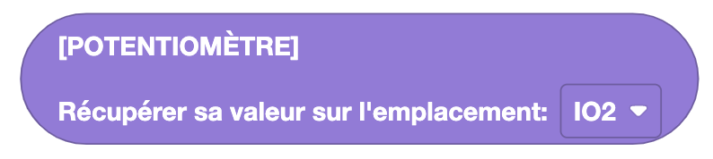

Eliobot est compatible avec certains modules Grove. Vous trouverez ci-dessous la liste des modules compatibles et les blocs associés.

## Compatibilité Grove

    🟢 : Compatible | 🟠 : Non testé | 🔴 : Non compatible

| Grove Modules            | Compatibilité |        État        |   Prérequis    |
|--------------------------|:-------------:|:------------------:|:--------------:|
| Button v1.2              |      🟢       | Ok Bloc Disponible | Grove Backpack |
| Touch v1.1               |      🟢       | Ok Bloc Disponible | Grove Backpack |
| Servo Moteur             |      🟢       | Ok Bloc Disponible | Grove Backpack |
| Rotary Sensor Angle v1.2 |      🟢       | Ok Bloc Disponible | Grove Backpack |
| Light Sensor V1.2        |      🟢       | Ok Bloc Disponible | Grove Backpack |
| Buzzer v1.2              |      🟢       |         Ok         | Grove Backpack |
| Temperature v1.2         |      🟢       |         Ok         | Grove Backpack |
| Sound Sensor v1.6        |      🟢       |         Ok         | Grove Backpack |
| LED Socket Kit v1.5      |      🟢       |         Ok         | Grove Backpack |
| Relay v1.2               |      🟠       |     Pas testé      | Grove Backpack |
| LCD RGB Backlight        |      🔴       |   Pas compatible   |                |

## Button v1.2 et Touch v1.1

### Utiliser le bouton ou le toucher

**Type** : Booléen

**Définition** :

Ce bloc permet d'utiliser les boutons Grove pour faire des actions avec Eliobot.

**Utilisation** :

Pour lancer le programme si un bouton est appuyé.

## Servo Motor

### Contrôler un servo moteur

**Type** : Commande

**Définition** :

Ce bloc permet de contrôler un servo moteur avec Eliobot.

**Utilisation** :

Pour rendre Eliobot plus interactif en lui permettant de bouger un bras ou une tête.

## Rotary Sensor Angle v1.2

### Récupérer la valeur d'un potentiomètre

**Type** : Valeur

**Définition** :

Ce bloc permet de récupérer la valeur d'un potentiomètre.

**Utilisation** :

Pour régler une valeur dans ton programme. Par exemple, pour régler la vitesse de déplacement d'Eliobot.

## Light Sensor V1.2

### Récupérer la valeur de luminosité

**Type** : Valeur

**Définition** :

Ce bloc permet de récupérer la valeur de luminosité mesurée par le capteur de luminosité.

**Utilisation** :

Pour régler une action en fonction de la luminosité. Par exemple, pour allumer une LED si la luminosité est faible.

## Buzzer v1.2

### Faire sonner un buzzer

**Type** : Commande

**Définition** :

Ce bloc permet de faire sonner le buzzer avec un certain volume (0-100).

**Utilisation** :

Pour faire un son d'alerte ou de notification.

