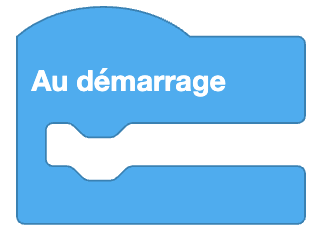

import Jump from '@site/src/components/Jump';

Les blocs basiques sont les premiers blocs que tu vas utiliser pour programmer Eliobot.

## Au démarrage

**Type** : Commande

**Définition** :

Ce bloc est une boucle qui est exécutée une seule fois au démarrage du programme seule les blocs dans cette boucle ou dans une boucle Répéter indéfiniment sont éxécutés les autres sont désactivés.

**Utilisation** :

Si on veut que Eliobot avance d'une case au démarrage.

## Répéter indéfiniment

**Type** : Commande

**Définition** :

Cette boucle répète indéfiniment les blocs qu'elle contient. Pour arrêter la boucle, il faut utiliser .

:::warning
Attention, après l'utilisation de cette boucle, **seulement** les blocs qui se trouvent à l'intérieur seront exécutés à l'infini.
:::

**Utilisation** :

Si on veut que Eliobot avance indéfiniment.

## Attendre X secondes

**Type** : Commande

**Définition** :

Ce bloc permet de faire une pause dans le programme pendant un certain nombre de secondes / millisecondes.

**Utilisation** :

Si tu veux faire une pause dans ton programme entre deux actions.

## Afficher une valeur dans le terminal

**Type** : Commande

**Définition** :

Ce bloc permet d'afficher une valeur dans le terminal. La valeur peut être un nombre, un texte ou un booléen.

**Utilisation** :

Si tu veux afficher une valeur pour débugger ton programme.