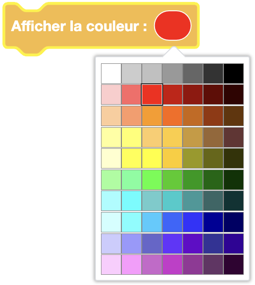

import Jump from '@site/src/components/Jump';


Eliobot est équipé d'une LED multicolore, permettant d'afficher plus de 16 millions de couleurs. 


## Séléctionner une couleur à afficher

La méthode la plus simple pour allumer la LED est d'utiliser le bloc ```Afficher la couleur``` qui propose la couleur rouge par défaut.


**Type** : Commande

**Définition** :

Elle peut être ensuite changée en cliquant sur la bulle colorée, révélant ainsi un tableau avec plusieurs couleurs.
Il ne reste alors plus qu'à cliquer sur celle que l'on souhaite afficher.



Attention, le noir correspond à une LED éteinte.

**Utilisation** :

Si tu veux allumer la LED avec une couleur spécifique. Par exemple, pour indiquer l'état d'un capteur.


## Eteindre la lumière


**Type** : Commande

**Définition** :

Deux possibilités pour éteindre la LED :

- La première est d'afficher la couleur noire avec le bloc ci-dessus, ce qui revient à mettre toutes les couleurs a 0
- La plus simple consiste à utiliser la bloc dédié ci-dessous ```Eteindre la lumière```

**Utilisation** :

Si tu veux éteindre la LED. Par exemple, pour indiquer la fin d'une action.

## Exemple

Découvre comment utiliser la LED dans l'exemple suivant :

<Jump to="/docs/tutorial/elioblocs/blink-led-elioblocs">Faire clignoter la LED - Elioblocs</Jump>

