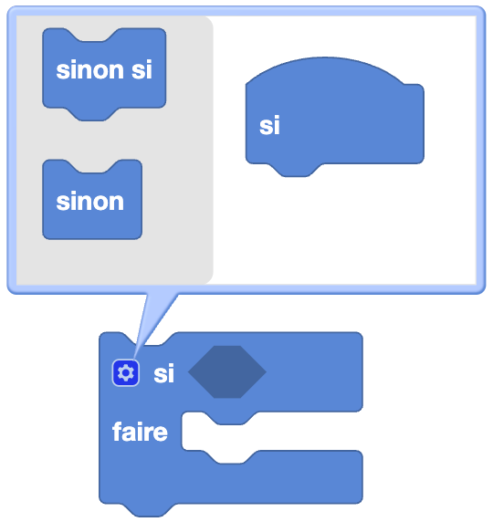

import Jump from '@site/src/components/Jump';

Dans la programmation on utilise 

## Si - Faire - Sinon

## Si - Faire

### Modification du bloc

## Comparaison

## Opération logique

## Non

## Vrai / Faux

## Nul

## Test

## Exemple 

Découvre l'utilisation des conditions dans l'exemple suivant :

<Jump to="/docs/tutorial/elioblocs/avoid-obstacles-elioblocs">Eviter des obstacles - Elioblocs</Jump>