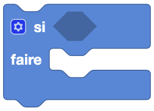
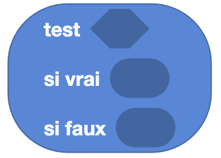

import Jump from '@site/src/components/Jump';

Les conditions permettent de réaliser des actions en fonction de certaines conditions. C'est ce qui permet de rendre un programme "intelligent" et de lui faire prendre des décisions.

Dans la programmation, on utilise 

## Si - Faire - Sinon

**Type** : Commande

**Définition** :

Ce bloc permet de réaliser une action si une condition est vraie, et une autre action si la condition est fausse.
Il est composé de trois parties :

- **Si** : la condition à vérifier (si elle est vraie, on exécute le bloc `Faire` on appelle cela un booléen).
- **Faire** : le bloc d'instructions à exécuter si la condition est vraie.
- **Sinon** : le bloc d'instructions à exécuter si la condition est fausse.

**Utilisation** :

Si on veut que Eliobot avance si un capteur détecte un obstacle, et recule si aucun obstacle n'est détecté.

## Si - Faire

Ce bloc reprend la même logique que le bloc `Si - Faire - Sinon` mais avec une spécificité, on peut modifier le bloc pour rajouter des conditions supplémentaires à l'aide de l'engrenage.

### Modification du bloc

**Type** : Commande

**Définition** :

Ici, tu peux empiler autant de conditions que tu veux. Si toutes les conditions sont vraies, alors la partie du bloc `Faire` sera exécuté.
Toutes les conditions sont vérifiées une par une dans l'ordre où elles sont empilées. Si une condition est fausse, alors le bloc `Faire` de celle-ci ne sera pas exécuté.

**Utilisation** :

Si on veut que Eliobot avance si un capteur détecte un obstacle, et recule si aucun obstacle n'est détecté, mais aussi que le robot s'arrête si un autre capteur détecte un obstacle.

> #### Exemple
>
> 
>
> Dans cet exemple, seule la première condition sera exécutée car c'est la première de la liste qui est vraie. Si la première condition avait été fausse, alors la deuxième condition aurait été vérifiée, et si celle-ci avait également été fausse, le bloc 'sinon' serait intervenu, agissant lorsque aucune des conditions précédentes n'est vérifiée.

## Comparaison

**Type** : Bloc booléen

**Définition** :

Ce bloc permet de comparer deux valeurs. Il est composé de deux parties :

- **Première valeur et deuxième valeur** : les valeurs à comparer.
- **Opérateur de comparaison** : le type de comparaison à effectuer (égal, différent, supérieur, inférieur, supérieur ou égal, inférieur ou égal).

**Utilisation** :

Si on veut savoir si deux valeurs sont égales, si une valeur est supérieure à une autre, etc.

## Opération logique

**Type** : Bloc booléen

**Définition** :

Ce bloc permet de réaliser une opération logique entre deux conditions. Il est composé de deux parties :

- **Première condition et deuxième condition** : les conditions à comparer.
- **Opérateur logique** : le type d'opération logique à effectuer (ET, OU).

**Utilisation** :

Si on veut savoir si deux conditions sont vraies ou si une condition est vraie.

## Non

**Type** : Bloc booléen

**Définition** :

Ce bloc permet de réaliser une négation d'une condition. Cela veut dire que peu importe la condition, si elle est vraie, elle deviendra fausse et inversement.

**Utilisation** :

Si on veut passer une condition de vraie à fausse ou inversement. 

## Vrai / Faux

**Type** : Bloc booléen

**Définition** :

Ce bloc permet de définir une valeur booléenne. Cela veut dire que la valeur est soit vraie, soit fausse.

**Utilisation** :

Si on veut définir une condition de départ.

## Nul

**Type** : Valeur

**Définition** :

Ce bloc permet de définir une valeur nulle. Cela veut dire que la valeur n'est pas définie (Cela ne veut pas dire zéro).
La valeur nul est souvent utilisée pour dire qu'une variable n'a pas de valeur ou n'est pas définie.

**Utilisation** :

Si on veut définir une variable sans lui donner de valeur.

## Test

**Type** : Valeur

**Définition** :

Ce bloc permet de tester une condition. Il est composé de deux parties :

- **Condition** : la condition à tester.
- **Valeur à utiliser** : Selon le résultat de la condition, la valeur à utiliser.

**Utilisation** :

Si on veut tester une condition et utiliser une valeur différente selon le résultat.

## Exemple 

Découvre l'utilisation des conditions dans l'exemple suivant :

<Jump to="/docs/tutorial/elioblocs/avoid-obstacles-elioblocs">Eviter des obstacles - Elioblocs</Jump>