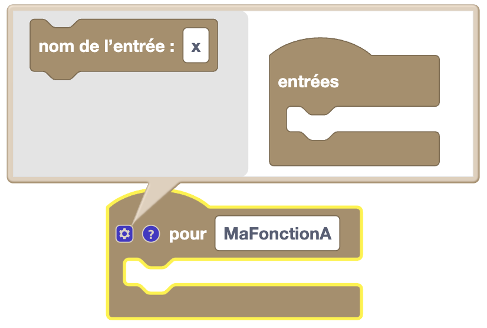

Les fonctions permettent de regrouper des blocs pour les réutiliser plus tard dans le programme.
Elles sont très utiles pour éviter de répéter plusieurs fois les mêmes blocs. 
On peut aussi leur donner des valeurs en entrée et récupérer une valeur en sortie.
On peut les appeler n'importe où dans le programme et plusieurs fois si besoin, tant qu'elles ont été déclarées avant.

## Créer une fonction

**Type** : Commande

**Définition** :

Une fonction est comme une boucle, elle contient des blocs à exécuter ces blocs seront éxécuté à l'appel de la fonction.
Tu peux utiliser le point d'interrogation pour ajouter un commentaire à ta fonction (dire ce qu'elle fait par exemple).

**Utilisation** :

Si on veut regrouper des blocs pour les réutiliser plus tard dans le programme. On essaie de mettre les actions redondantes dans une fonction pour éviter de les répéter plusieurs fois.

## Appeler une fonction

**Type** : Commande

**Définition** :

Ce bloc permet d'appeler une fonction. Les blocs à l'intérieur de la fonction seront exécutés.

**Utilisation** :

Si on veut exécuter les blocs d'une fonction sans avoir à les réécrire.

## Récupérer une valeur en sortie de la fonction

**Type** : Commande

**Type** : Valeur

**Définition** :

Il existe des fonctions qui retournent une valeur. Comme une fonction normale les blocs à l'intérieur seront exécutés, mais en plus, elle retournera une valeur à la fin. Cette valeur peut être utilisée dans le reste du programme.

**Utilisation** :

Si on veut récupérer une valeur d'une fonction pour l'utiliser dans le reste du programme. Par exemple, si on fait un calcul dans une fonction, on peut récupérer le résultat pour l'utiliser dans le reste du programme.

## Ajouter des valeurs en entrée de la fonction

**Type** : Commande

**Définition** :

Il est possible de donner des valeurs à une fonction pour qu'elle les utilise. Ces valeurs sont appelées des paramètres.
Pour ajouter des paramètres à une fonction, il suffit de les ajouter dans le bloc de la fonction à l'aide de l'engrenage.
Quand on appelle la fonction, on doit donner des valeurs pour ces paramètres.

**Utilisation** :

Imaginons avoir une fonction qui calcule Pythagore, on peut lui donner les deux côtés du triangle pour qu'elle nous retourne l'hypoténuse.

## Sortir d'une fonction

**Type** : Commande

**Définition** :

Ce bloc permet de sortir d'une fonction et de retourner une valeur si une condition est remplie.

**Utilisation** :

Si on veut sortir d'une fonction avant la fin, on peut utiliser ce bloc pour retourner une valeur.
