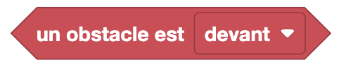
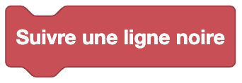
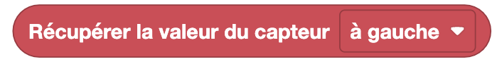
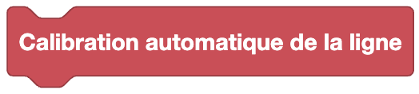
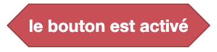
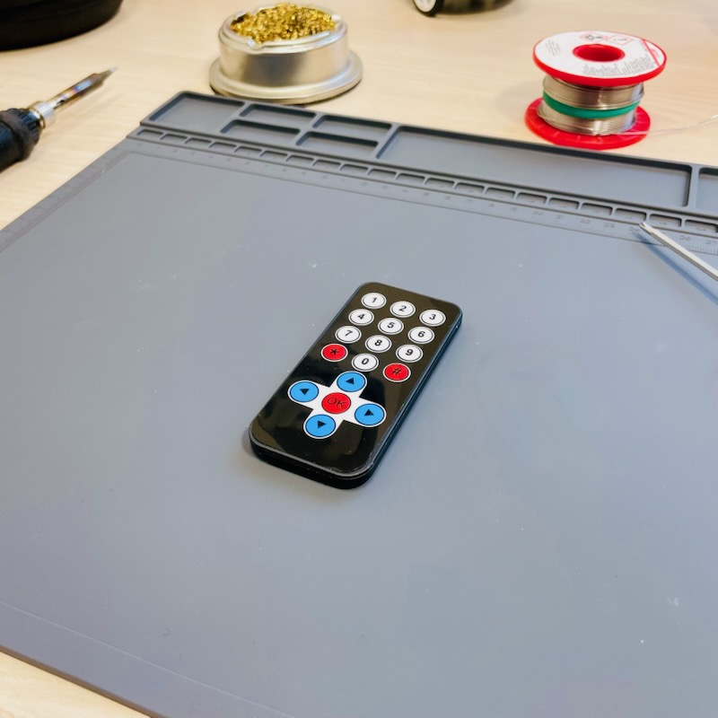
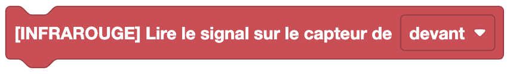
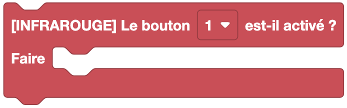

Les blocs d'entrées permettent de récupérer des informations de l'environnement d'Eliobot.

Les blocs de capteur d'obstacles permettent de tester la présence d'un obstacle proche d'Eliobot.

## Tester la présence d'un obstacle

**Type** : Bloc booléen

**Définition** :

Ce bloc permet de tester la présence d'un obstacle à une certaine distance d'Eliobot :
- à l'avant
- à l'arrière
- à gauche
- à droite

**Utilisation** :

Si tu veux éviter les obstacles tels des murs ou des objets.

---

Les blocs de capteur de ligne permettent de suivre une ligne ou de tester la présence d'une ligne.

## Suivre une ligne

**Type** : Commande

**Définition** :

Ce bloc permet de suivre une ligne noire.

**Utilisation** :

Si on veut que Eliobot suive une ligne noire sur un parcours, celui au dos de ta notice par exemple.

## Tester la présence d'une ligne

**Type** : Bloc booléen

**Définition** :

Ce bloc permet de tester la présence d'une ligne noire sous Eliobot :
- au milieu
- à gauche
- à droite
- au milieu gauche
- au milieu droit

**Utilisation** :

Pour permettre à Eliobot de suivre une ligne noire sur un parcours et de tester s'il faut tourner à gauche ou à droite.

## Modifier la sensibilité du capteur de ligne

**Type** : Commande

**Définition** :

Ce bloc permet de modifier la sensibilité du capteur de ligne. Change la valeur a laquelle le capteur de ligne détecte une ligne.

**Utilisation** :

Si tu es dans un espace très lumineux ou très sombre, tu peux modifier la sensibilité du capteur de ligne pour qu'il détecte mieux la ligne.

## Lire la valeur d'un capteur de ligne

**Type** : Valeur

**Définition** :

Ce bloc retourne la valeur du capteur de ligne. On peut l'afficher dans le terminal par exemple.
Il peut être utilisé pour définir la sensibilité du capteur de ligne.

**Utilisation** :

Si tu veux récupérer la valeur du capteur de ligne pour mieux calibrer la sensibilité du capteur de ligne.

## Calibration automatique de ligne

**Type** : Commande

**Définition** :

Ce bloc permet de calibrer automatiquement le capteur de ligne. Il permet de définir la valeur à laquelle le capteur de ligne détecte une ligne.

**Utilisation** :

Il faut placer les 5 capteurs de ligne au-dessus d'une ligne noire et eliobot va calibrer automatiquement la valeur à laquelle il détecte la ligne en
avançant et en reculant. Eliobot doit être perpendiculaire sur la ligne pour que la calibration soit correcte.

---

## Tester si le bouton est activé

**Type** : Bloc booléen

**Définition** :

Ce bloc permet de tester si le bouton d'Eliobot est activé, il renvoie `vrai` si le bouton est activé et `faux` sinon.

**Utilisation** :

Si tu veux réaliser une action seulement si le bouton d'Eliobot est activé. Démarrer ton programme par exemple.

---

## La télécommande infrarouge

Pour utiliser les blocs de la télécommande infrarouge, il faut se munir de la télécommande infrarouge disponible dans le kit Eliobot.

[Achetez ici](https://eliobot.com/products/telecommande-infra-rouge)

## Choisir le capteur pour la lecture

**Type** : Commande

**Définition** :

Ce bloc permet de choisir le capteur infrarouge pour la lecture des commandes de la télécommande infrarouge,
on peut choisir entre le capteur avant et le capteur arrière.

**Utilisation** :

Si tu veux que les commandes de la télécommande infrarouge soient lues par le capteur avant ou arrière.
Par exemple pour suivre Eliobot et lui envoyer des commandes alors que tu es derrière lui.

## Lire la commande de la télécommande infrarouge

  

**Type** : Commande

**Définition** :

Ce bloc permet de lire la commande de la télécommande infrarouge et de réaliser une action en fonction de la commande reçue.

**Utilisation** :

Si tu veux que Eliobot réalise une action en fonction de la commande reçue par la télécommande infrarouge.
Par exemple, avancer, reculer, tourner à gauche ou à droite. Tu peux aussi lui faire jouer une musique ou allumer une LED.

