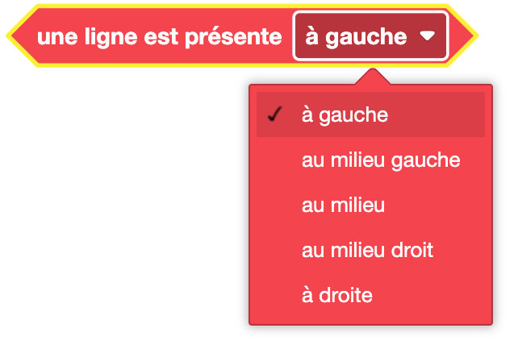

Les blocs de capteur de ligne permettent de suivre une ligne ou de tester la présence d'une ligne.

## Suivre une ligne 

**Définition** :

Ce bloc permet de suivre une ligne noire.

**Utilisation** :

Si on veut que Eliobot suive une ligne noire sur un parcours, celui au dos de ta notice par exemple.

## Tester la présence d'une ligne

**Définition** :

Ce bloc permet de tester la présence d'une ligne noire sous Eliobot :
- au milieu
- à gauche
- à droite
- au milieu gauche
- au milieu droit

**Utilisation** :

Pour permettre à Eliobot de suivre une ligne noire sur un parcours et de tester si il faut tourner à gauche ou à droite.

## Modifier la sensibilité du capteur de ligne

**Définition** :

Ce bloc permet de modifier la sensibilité du capteur de ligne. Change la valeur a laquelle le capteur de ligne détecte une ligne.

**Utilisation** :

Si tu es dans un espace très lumineux ou très sombre, tu peux modifier la sensibilité du capteur de ligne pour qu'il détecte mieux la ligne.

## Lire la valeur d'un capteur de ligne

**Définition** :

Ce bloc retourne la valeur du capteur de ligne. On peut l'afficher dans le terminal par exemple.
Il peut être utilisé pour définir la sensibilité du capteur de ligne.

