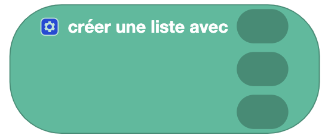

## Créer une liste 

### Liste vide

### Liste avec éléments définis 

### Liste avec élément répété

### Liste depuis un texte

## Connaitre la longueur d'une liste

## Tester si une liste est vide

## Trouver une occurence dans une liste

## Modifier une liste

## Trier une liste

