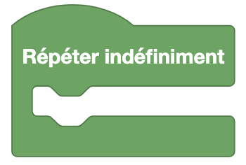
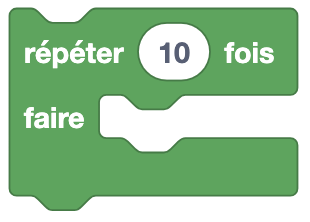
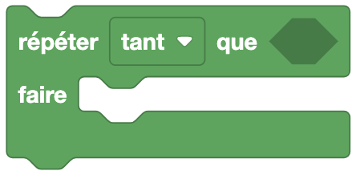
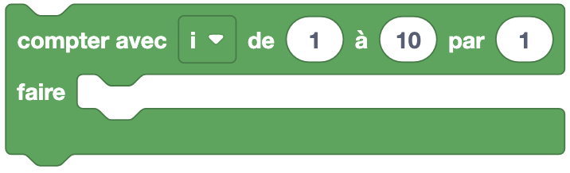
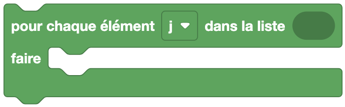
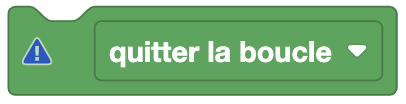

Les boucles permettent de répéter des actions un certain nombre de fois où jusqu'à ce qu'une condition soit remplie (ou pas). Elles sont très utiles pour automatiser des tâches répétitives.


## Répéter indéfiniment



Cette boucle répète indéfiniment les blocs qu'elle contient. Pour arrêter la boucle, il faut utiliser . Attention, après l'utilisation de cette boucle, **seulement** les blocs qui se trouve a l'intérieur seront exécuter à l'infini.

## Répéter X fois



Cette boucle répète un certain nombre de fois les blocs qu'elle contient. Pour définir le nombre de répétitions, on peut directement écrire le nombre de fois souhaité dans la case ou utiliser un bloc contenant une valeur.

## Répéter tant que



Cette boucle est composée de deux parties :

- **Condition** : tant/jusqu'à ce que cette condition est/soit vraie.
- **Condition à vérifier** : la condition à vérifier à chaque tour de boucle.

> ### Tant que
>
> Cette boucle répète les blocs qu'elle contient tant que la condition est vraie.
>
> ### Jusqu'à ce que
>
> Cette boucle répète les blocs qu'elle contient jusqu'à ce que la condition soit vraie.

## Compter avec ```i```



Cette boucle permet de répéter un certain nombre de fois les blocs qu'elle contient en utilisant une variable ```i``` qui va de 0 à la valeur définie. Cette variable ```i``` est incrémentée à chaque tour de boucle par la dernière valeur.

> #### Détail
> 
> 
> 
> 1. Valeur de début des itérations.
> 2. Valeur de fin des itérations.
> 3. Incrémentation de la variable ```i``` à chaque tour de boucle.


## Pour ```i``` dans la liste



Cette boucle permet de répéter les blocs qu'elle contient le nombre de fois qu'il y a d'éléments dans une liste.


## Quitter la boucle ou Passer à l'itération de boucle suivante



Ce bloc à deux utilisations :

- **Quitter la boucle** : permet de quitter la boucle actuelle.
- **Passer à l'itération suivante** : permet de passer à l'itération suivante de la boucle actuelle.


