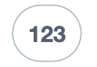

Les blocs de mathématiques permettent de réaliser des opérations mathématiques de base. Ils sont très utiles pour réaliser des calculs.

## Nombre entier

**Type** : Valeur

**Définition** :

Ce bloc permet de définir un nombre entier.

**Utilisation** :

Si on veut définir un nombre entier (dans un autre bloc par exemple).

## Opérations basiques

**Type** : Valeur

**Définition** :

Ce bloc permet de réaliser :
- addition
- soustraction
- multiplication
- division
- puissance

**Utilisation** :

Si on veut réaliser une opération mathématique simple.

## Fonctions basiques

**Type** : Valeur

**Définition** :

Ce bloc permet de calculer :
- la racine carrée
- valeur absolue
- negation
- logarithme népérien
- logarithme en base 10
- exponentielle
- puissance de 10

**Utilisation** :

Si on veut réaliser une opération mathématique un peu plus complexe.

## Trigonométrie

**Type** : Valeur

**Définition** :

Ce bloc permet de calculer les fonctions trigonométriques :
- sinus
- cosinus
- tangente
- arc-sinus
- arc-cosinus
- arc-tangente

**Utilisation** :

Si on veut réaliser des calculs trigonométriques pour faire tracer des triangles à Eliobot par exemple.

## Constantes

**Type** : Valeur

**Définition** :

Ce bloc permet de récupérer la valeur des constantes mathématiques :
- pi
- e
- phi
- racine de 2
- racine de 1/2
- infini

**Utilisation** :

Calculs mathématiques avancés (périmètre d'un cercle, aire d'un triangle, etc).

## Tester un entier

**Type** : Bloc booléen

**Définition** :

Ce bloc permet de tester si un nombre est :
- pair
- impair
- positif
- négatif
- entier
- premier
- divisible par

**Utilisation** :

Si on veut tester un nombre pour réaliser une action en fonction de sa valeur.

## Arrondir

**Type** : Valeur

**Définition** :

Ce bloc permet d'arrondir un nombre :
- à l'entier le plus proche
- à l'entier supérieur
- à l'entier inférieur

**Utilisation** :

Si on veut arrondir un nombre pour l'utiliser en tant que nombre d'itérations par exemple, on peut faire 2 ou 3 itérations, mais pas 3,33.

## Opération sur listes

**Type** : Valeur

**Définition** :

Ce bloc permet de réaliser des opérations sur des listes :
- somme
- moyenne
- minimum
- maximum
- médiane
- majoritaire
- écart-type
- élément aléatoire

**Utilisation** :

Si on veut réaliser des calculs sur une liste de nombres. Ou si on veut récupérer un élément aléatoire d'une liste.

## Reste d'une division

**Type** : Valeur

**Définition** :

Ce bloc permet de récupérer le reste d'une division (modulo).

**Utilisation** :

Si on veut récupérer le reste d'une division pour réaliser une action en fonction de ce reste.

## Contraindre un entier entre deux valeurs

**Type** : Valeur

**Définition** :

Ce bloc permet de contraindre un nombre entre deux valeurs.
Cela permet de s'assurer que le nombre est dans un intervalle donné.

**Utilisation** :

Si on veut s'assurer qu'un nombre est dans un intervalle donné avant de l'utiliser. Si on utilise des pourcentages par exemple, on veut s'assurer que le nombre est entre 0 et 100.

## Génération d'entier aléatoire

**Type** : Valeur

**Définition** :

Ce bloc permet de générer un nombre aléatoire entre deux bornes.

**Utilisation** :

Si on veut générer un nombre aléatoire pour réaliser une action aléatoire.

## Génération de fraction aléatoire

**Type** : Valeur

**Définition** :

Ce bloc permet de générer une fraction aléatoire.

**Utilisation** :

Si on veut générer une fraction aléatoire pour réaliser une action aléatoire.

## atan2

**Type** : Valeur

**Définition** :

Ce bloc permet de calculer l'arc tangente de deux nombres.
Il est utilisé pour obtenir l'angle entre deux points.

**Utilisation** :

Si on veut calculer l'angle entre deux points pour faire tourner Eliobot par exemple.

