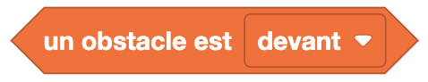
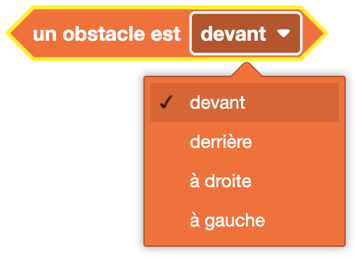

Les blocs de capteur d'obstacles permettent de tester la présence d'un obstacle proche d'Eliobot.

## Tester la présence d'un obstacle

**Type** : Bloc booléen

**Définition** :

Ce bloc permet de tester la présence d'un obstacle à une certaine distance d'Eliobot :
- à l'avant
- à l'arrière
- à gauche
- à droite

**Utilisation** :

Si tu veux éviter les obstacles tels des murs ou des objets.