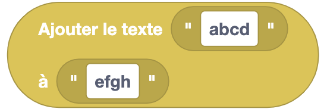
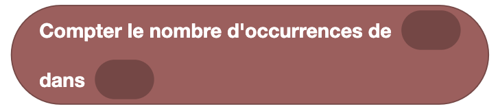

Les blocs de texte permettent de manipuler des chaînes de caractères.

## Commentaire

**Type** : Commande

**Définition** :

Ce bloc permet d'ajouter un commentaire dans le code.

**Utilisation** :

Si tu veux ajouter une note dans ton code pour expliquer une partie de ton programme. Il ne sert qu'à toi et n'est pas exécuté par Eliobot.

## Écrire un message

**Type** : Commande

**Définition** :

Ce bloc permet d'écrire un message dans le terminal.

**Utilisation** :

Si tu veux afficher un message dans le terminal. Cela peut être utile pour débugger ton programme.

## Variable de texte

**Type** : Valeur

**Définition** :

Ce bloc permet de définir une variable de type texte.

**Utilisation** :

Si tu veux stocker un texte pour l'utiliser dans ton programme.

## Ajouter le texte

**Type** : Valeur

**Définition** :

Ce bloc permet d'ajouter un texte à un autre.

**Utilisation** :

Si tu veux concaténer deux textes. Par exemple, si tu veux ajouter un prénom à un nom.

## Modifier la casse

**Type** : Valeur

**Définition** :

Ce bloc permet de modifier la casse d'un texte.

**Utilisation** :

Si tu veux mettre un texte en majuscules ou en minuscules.

## Inverser le texte

**Type** : Valeur

**Définition** :

Ce bloc permet d'inverser un texte.

**Utilisation** :

Si tu veux inverser un texte. Par exemple, si tu veux lire un texte à l'envers. 

:::tip
Tu peux essayer avec "kayak". 😉
:::

## Compter les occurrences

**Type** : Valeur

**Définition** :

Ce bloc permet de compter le nombre d'occurrences d'un texte dans un autre.

**Utilisation** :

Si tu veux savoir combien de fois un mot apparaît dans un texte.

## Supprimer les espaces

**Type** : Valeur

**Définition** :

Ce bloc permet de supprimer les espaces d'un texte.

**Utilisation** :

Si tu veux supprimer les espaces d'un texte. Par exemple, si tu veux enlever les espaces d'une phrase pour la comparer à une autre.

## Nettoyer le terminal

**Type** : Commande

**Définition** :

Ce bloc permet de nettoyer le terminal. Repartir sur une page vierge.

:::note
Remarque : le terminal n'est pas vraiment effacé, on saute plusieurs lignes pour ne plus voir les anciens messages.
Tu peux toujours remonter pour voir les messages précédents.
:::

**Utilisation** :

Si tu veux nettoyer le terminal pour avoir une meilleure lisibilité de ton programme.

