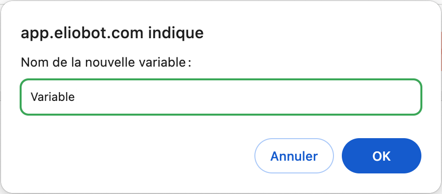
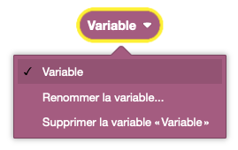

Les variables permettent de stocker des valeurs pour les réutiliser plus tard dans le programme. Elles sont très utiles pour stocker des données de tout type.

## Créer une variable

## Appeler une variable

**Définition** :

Une variable peut être appelée n'importe où dans le programme, tant qu'elle a été déclarée avant.

**Utilisation** :

Si on veut utiliser une variable pour stocker une valeur et la réutiliser plus tard.

## Modifier une variable

**Définition** :

On peut :
- Changer le nom de la variable
- Supprimer la variable

**Utilisation** :

Si on veut modifier une variable déjà créée.

### Définir à une valeur précise

**Définition** :

Définir une variable à une valeur précise. Cette valeur peut être un nombre, un texte, une liste, etc.

**Utilisation** :

Si on veut définir une variable à une valeur, par exemple pour garder en memoire la position d'un élément d'une liste.

### Incrémenter

**Définition** :

Incrémenter une variable sert à augmenter la valeur d'une variable de la valeur souhaitée.

**Utilisation** :

Si on veut augmenter une variable de 1 à chaque tour de boucle par exemple.

