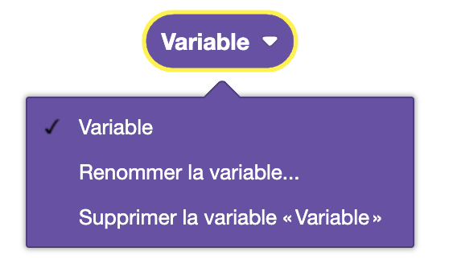

Les variables permettent de stocker des valeurs pour les réutiliser plus tard dans le programme. Elles sont très utiles pour stocker des données de tout type.

## Créer une variable

## Appeler une variable

Une variable peut être appelée n'importe où dans le programme, tant qu'elle a été déclarée avant.

## Modifier une variable

On peut :
- Changer le nom de la variable
- Supprimer la variable

### Définir à une valeur précise

Définir une variable à une valeur précise. Cette valeur peut être un nombre, un texte, une liste, etc.

### Incrémenter

Incrémenter une variable sert à augmenter la valeur d'une variable de la valeur souhaitée.

