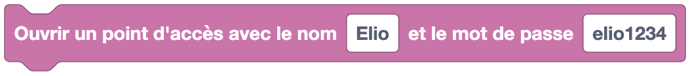
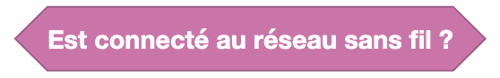
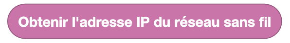
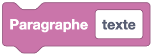

Les blocs de réseau permettent de réaliser des actions liées à la connexion d'Eliobot à un réseau sans fil.

# Connexion Sans Fil

---

## Se connecter à un réseau sans fil

## Se déconnecter d'un réseau sans fil

## Ouvrir un point d'accès depuis Eliobot

## Est connecté à un réseau sans fil ?

## Scanner les réseaux sans fil disponibles

## Obtenir l'adresse IP du réseau sans fil

# Serveur Http

---

## Créer une route API 

## Créer une route API avec retour

## Récupérer l'état d'un bouton

## Récupérer l'état d'un variateur

## Servir le contenu d'un fichier

## Démarrer le serveur web

# Page HTML

---

## Cree une page html

## Cree une balise html

## Cree un titre html

## Cree un paragraphe html

## Cree un bouton html

## Cree un variateur html

