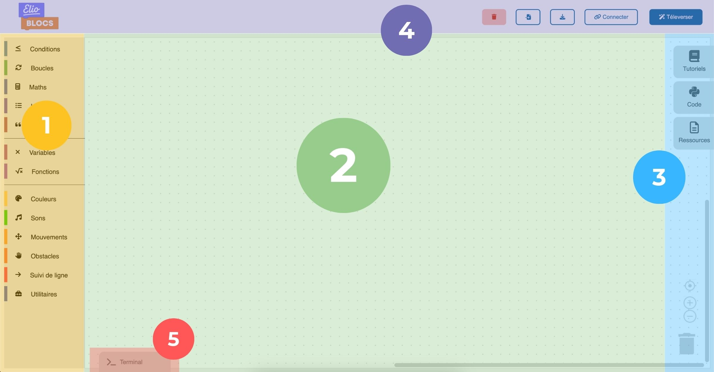

Voici comment se compose l’interface. Cette partie d’explication te servira pour la suite du tutoriel.

> 1. La boîte à outils (l’espace où tu retrouveras l’ensemble des blocs nécessaires pour la programmation).
> 
> 2. L’espace de travail (c'est où tu pourras assembler tes blocs).
> 
> 3. Les onglets te permettant d'accéder aux tutoriels, de l'aide, ainsi que voir le code qui va s'écrire quand tu poses des blocs.
>     
> 4. Les boutons :
>    - Tout effacer : pour nettoyer ton espace de travail en un seul clic.
>    - Importer : ouvre un programme précédemment enregistré.
>    - Sauvegarder : sauvegarde ton programme sur ton ordinateur.
>    - Connecter : pour connecter Eliobot à ton ordinateur.
>    - Téléverser : pour envoyer le code à Eliobot.
> 
> 5. Le terminal (c'est là où tu pourras voir les messages d'erreur ou de succès de ton programme et communiquer avec Eliobot).