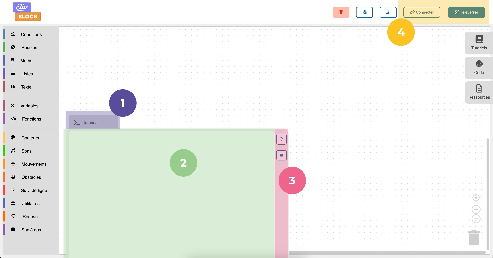
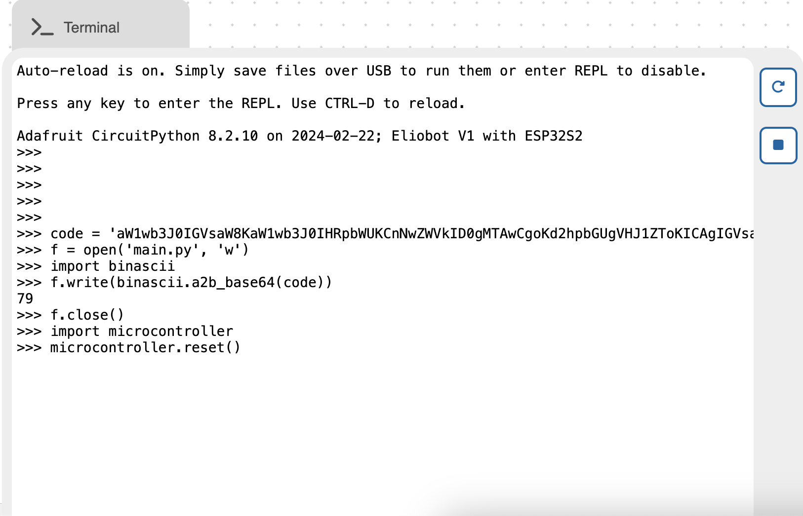
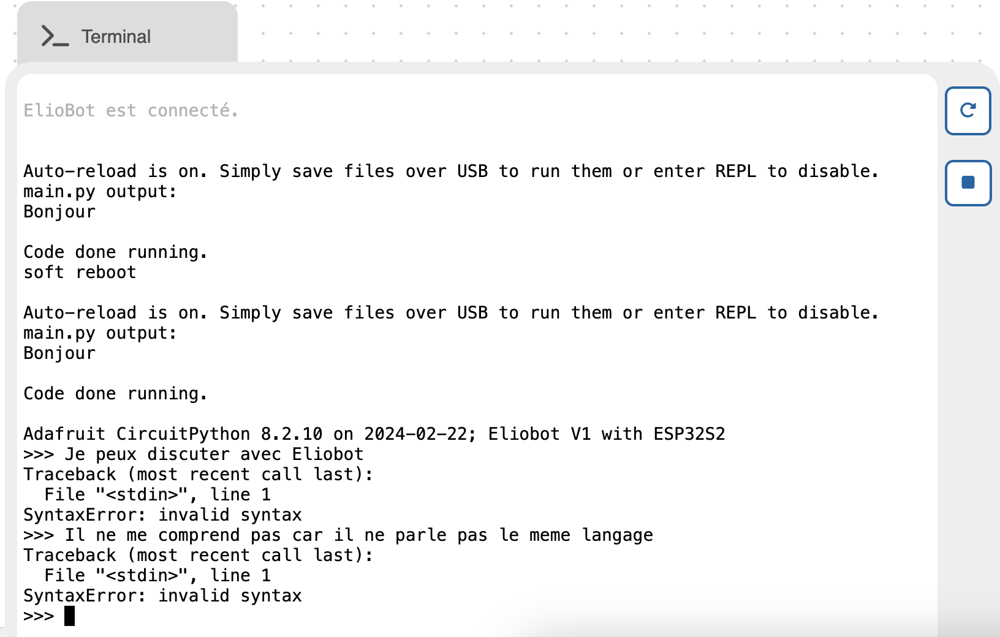

#### Voici comment se compose le terminal. Cette partie d’explication te servira pour la suite.

> 1. C'est le bouton "tiroir" qui te permet d'ouvrir ou de fermer le terminal.
> 
> 2. C'est la zone de texte, c'est ici que tu vas pouvoir communiquer avec Eliobot et voir les messages d'erreur ou de réussite de ton programme et ce qu'il a pu te répondre.
> 
> 3. C'est la zone de bouton du terminal :
> 
>    - Redémarrer le programme : pour relancer le programme que tu as téléversé à Eliobot.
>    - Arrêter le programme : pour arrêter le programme en cours d'exécution.
> 
> 4. C'est deux boutons sont ceux qui vont te permettre de faire fonctionner le terminal :
> 
>    - Téléverser : Ce bouton envoie le code à Eliobot, comme vu précédemment, mais si tu te rends dans le terminal après avoir téléversé le code, tu pourras voir le code qui a été envoyé (le code est envoyé dans un langage appelé le binaire; c'est normal si tu n'arrives pas à le lire).
>   
>      
>   
>    - Connecter : Ce bouton permet d'établir la connexion entre Eliobot et ton ordinateur, c'est ce qui va permettre de communiquer entre les deux. Le terminal va servir de messagerie pour cela. 
>    
>      

Eliobot est un robot qui parle avec le langage de programmation Python. C'est pour cela que tu vas voir des messages en anglais dans le terminal. Mais ne t'inquiète pas, on va t'aider à comprendre ce qu'il te dit.

---

### Les fonctionnalités du terminal

#### Écouter Eliobot

Quand dans un de tes programmes avec Elioblocs, tu utilises le bloc  ou , Eliobot va écrire dans le terminal. Tu pourras voir ce qu'il te dit et comprendre ce qu'il se passe. 
Si un de tes programmes ne fonctionne pas et que la LED clignote en rouge, tu pourras voir dans le terminal ce qui ne va pas.

#### Envoyer des commandes à Eliobot

Quand dans le terminal tu vois `>>>`, c'est Eliobot qui te demande de lui envoyer une commande. Tu peux lui envoyer des commandes en Python pour qu'il les exécute.
Si tu veux en savoir plus, tu peux aller voir la <a href="https://learn.adafruit.com/welcome-to-circuitpython/the-repl" target="_blank" rel="noopener noreferrer" style={{color : 'blue'}}>Documentation CircuitPython</a>.

#### Problèmes avec le terminal ?

Si, après avoir cliqué sur le bouton , le message `Eliobot est connecté` s'affiche, mais que rien ne se passe, tu peux essayer de cliquer sur le bouton  pour relancer le programme, ou sur  ton programme est peut-être toujours en cours d'exécution. Si rien ne se passe, débranche Eliobot de ton ordinateur, éteins-le et reconnecte-le.