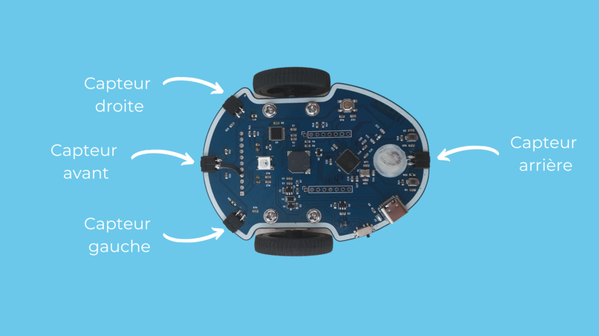
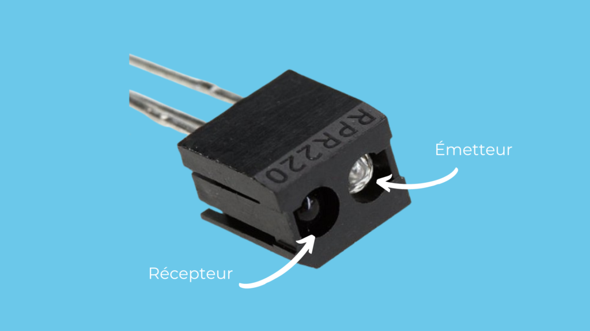
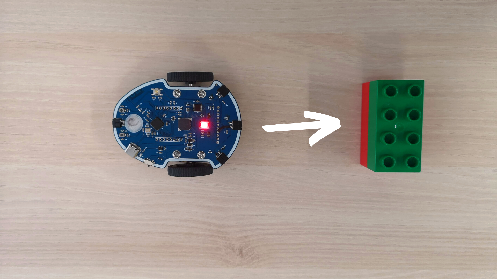
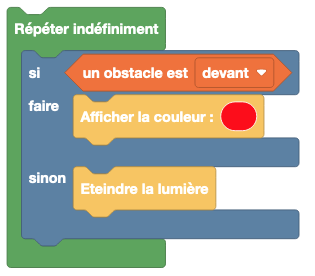
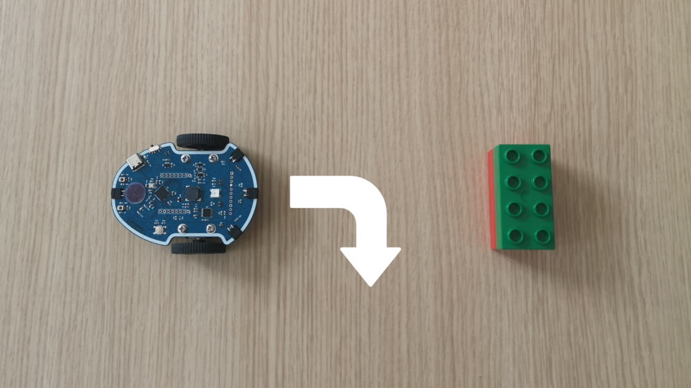

# Eviter les obstacles

Dans ce tutoriel, nous allons apprendre à utiliser des capteurs pour utiliser Eliobot en toute autonomie et lui faire éviter un obstacle 😉


## Fonctionnement des capteurs infrarouges

Eliobot est doté de 4 capteurs infrarouges (voir le schéma ci-dessous) qui lui permettent de détecter des obstacles.



Mais techniquement ça fonctionne comment ? 🤔

Chaque capteur est composé d’un émetteur et d’un récepteur. Le rôle de l’émetteur est d’envoyer de la lumière pour éclairer les obstacles. La lumière va alors être réfléchie en direction du récepteur, qui va nous permettre de connaitre la quantité de lumière reçu et donc en déduire une distance.

Plus la quantité de lumière est importante, plus l’obstacle est proche.



## Détecter un obstacle

Pour débuter ce tutoriel, rendez-vous sur notre interface de programmation https://app.eliobot.com/.

On commence avec un premier exemple simple : si Eliobot détecte un obstacle devant lui, la LED rouge s’allume. Si Eliobot ne détecte aucun obstacle, la LED s’éteint 💡



La première étape est de sélectionner l’action de détection d’obstacle. Pour cela, rend-toi dans l'onglet ```Obstacles``` puis séléctionne le bloc ```un obstacle est devant```.

Il est possible de choisir quel capteur utiliser, dans notre cas ce sera le capteur avant.

Tu as sans doute remarqué que ce nouveau bloc à une forme différente et ne peut pas être utilisé en l'état avec les blocs utilisé jusque là. Il s'agit d'un booléen que nous allons pouvoir utiliser en tant que condition dans le bloc ```Si... faire... Sinon``` .

Enfin pour bien identifier quand un obstacle a été détecté, on affiche une couleur avec le bloc ```Afficher la couleur``` en face de ```faire ```, et ```Eteindre la lumière``` en face de "sinon```

Sélectionne la couleur de ton choix, c’est toi l’artiste ! 😉



## Contourner l’obstacle

Maintenant que Eliobot est capable de détecter un obstacle, on va pouvoir lui dire quoi faire lorsqu'il en rencontre un. L'action la plus simple est tout simplement de changer de direction en pivotant à droite ou à gauche.



La plus grand partie du travail étant déjà faite avec le programme ci-dessus, nous allons le reprendre en y ajoutant des déplacement en plus des commandes pour la LED.

Dans un premier temps on définit le mouvement à effectuer lorsque Eliobot rencontre un obstacle, dans notre cas faire un quart de tour à droite. Pour cela tu peux prendre le bloc ```Pivoter vers la droite de 90 degrés``` dans l'onglet ```Mouvements``` et l'ajouter en dessous de la couleur rouge.

Ensuite on définit le mouvement à effectuer lorsqu'il n'y a pas d'osbtacle, soit avancer. Tu trouveras le bloc ```Se déplacer vers l'avant``` dans l'onglet ```Mouvements``` également, qui viendra se placer dans la partie ```sinon```


### Transfert du programme

Pour tester le programme sur Eliobot, branche-le à l’ordinateur avec le câble USB et clique sur le bouton « Programmer ».

Tu verras alors la LED clignoter et une fois fini tu peux débrancher Eliobot pour voir le résultat ! 🙂
