# Faire clignoter la LED

Maintenant que tu as assemblé ton Eliobot, tu vas apprendre à le programmer. Dans ce tutoriel, nous allons te guider pour créer un programme de test très simple qui te permettra de prendre en main l’interface.

## Création du programme

Ce programme « test » te permettra de faire clignoter une lumière de couleur verte (où celle de ton choix) sur Eliobot. Suis toutes les étapes attentivement et le résultat sera au rendez-vous 🙂

### Sélection de la couleur

La première étape consiste à sélectionner une couleur. Vas dans votre boîte à outils et clique sur le bloc « Couleurs ». Sélectionne le bloc « Afficher la couleur » et glisse-le dans l’espace de travail.

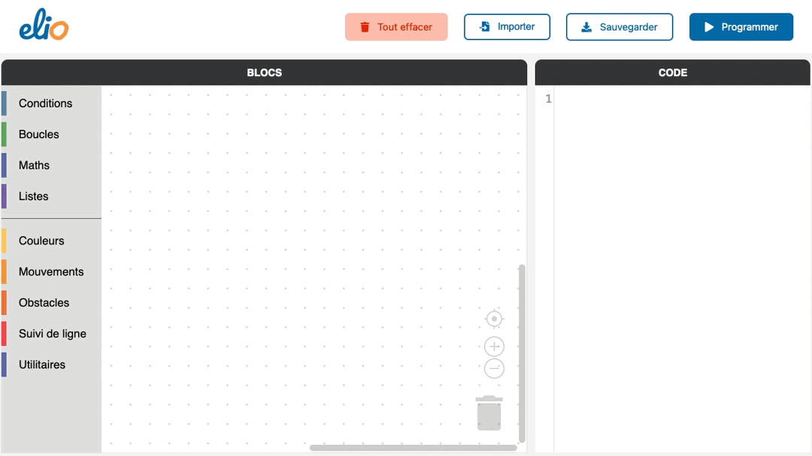

### Choix de la couleur

Tu peux ensuite modifier la couleur de la lumière qui s’allumera sur Eliobot.

Clique sur la pastille rouge dans l’espace de travail puis sélectionne la couleur que tu souhaites obtenir.

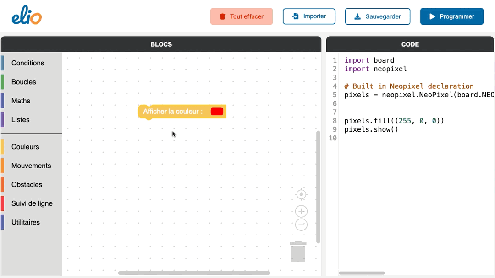

Il est possible de créer la couleur de ton choix : vert, bleu, rose, jaune… amuse-toi !

### Choix de la temporisation

La troisième étape consiste à déterminer le temps pendant lequel la lumière va rester allumée.

Clique sur le bloc « Utilitaires » puis sur « Attendre 1 seconde(s) ». Glisse le bloc dessous le premier dans l’espace de travail.

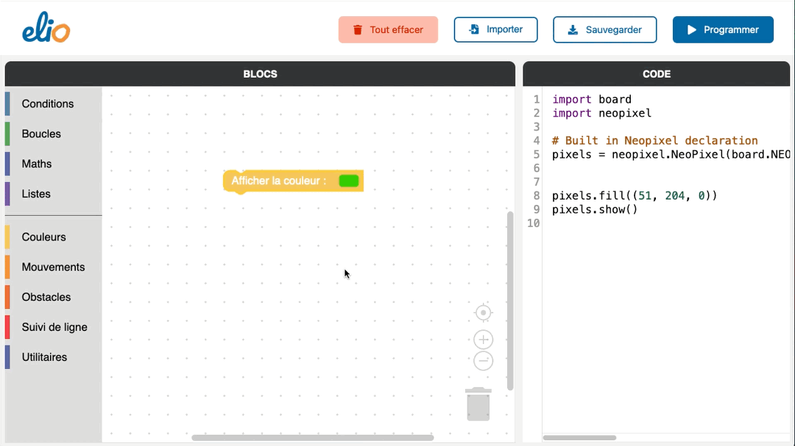

As-tu remarqué l’ombre qui apparaît sous le bloc lorsque tu l’approches d’un autre ?
Relâche le et il viendra alors s’assembler

### Éteindre la lumière

La quatrième étape consiste à éteindre la lumière pour provoquer l’effet de clignotement.

Pour éteindre la lumière de Eliobot, retourne dans « Couleurs » et insère le bloc « Eteindre la lumière » après les autres.

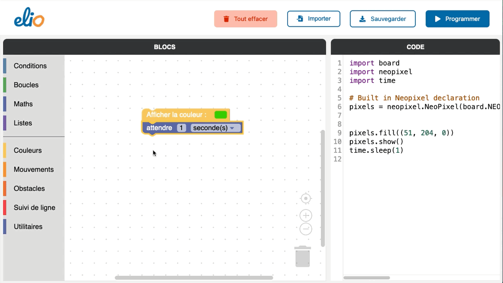

### Choix de la temporisation

La cinquième étape consiste à déterminer le temps pendant lequel la lumière va rester éteinte.

Tu peux donc à nouveau ajouter un bloc « Attendre 1 seconde(s) » tout en bas.

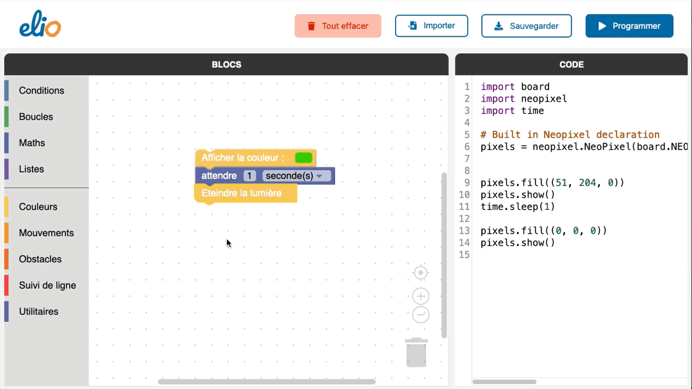

### Création d’une boucle

La sixième étape consiste à créer une boucle afin que la LED clignote à l’infini.

Clique sur la catégorie « Boucles » puis sur « répéter tant que … faire ». Glissez-le autour des blocs à déjà présents pour les inclure dans la boucle.

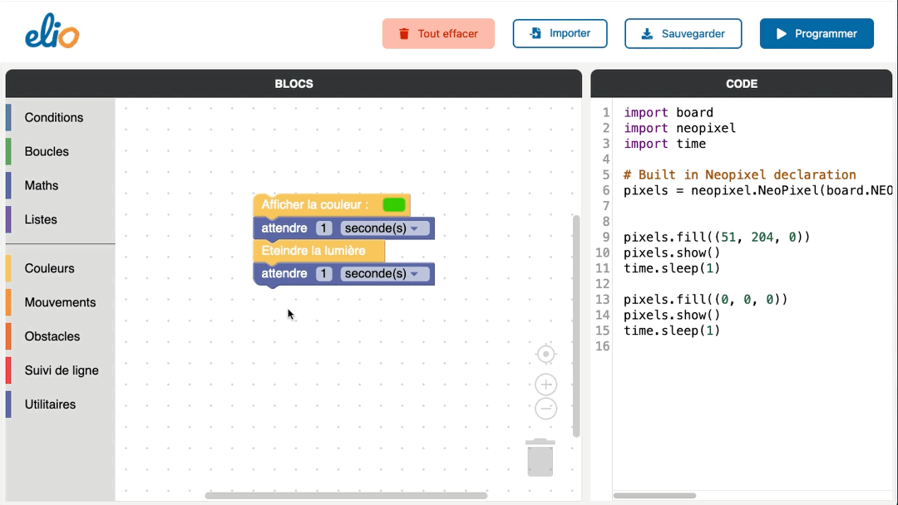

Regarde, sur le bloc de couleur verte en haut, il manque un morceau pour que la boucle soit complète.

Eliobot attend une condition pour exécuter son programme, nous allons donc forcer la boucle afin que le programme se répète à l’infini quelle que soit la condition.

Dans « Conditions » sélectionne le bloc « vrai ». Glisse ce bloc en haut de la boucle afin de la compléter, et voila !

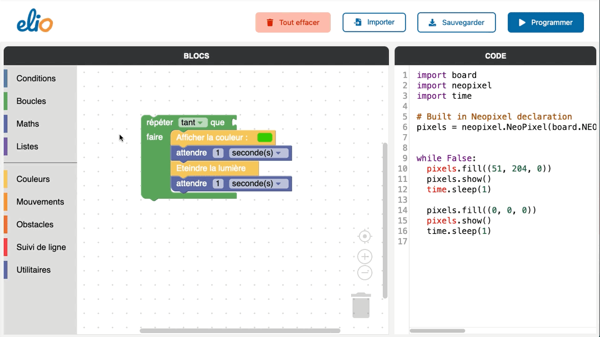

## La programmation de Eliobot

### Branchement de Eliobot

C’est le moment de brancher Eliobot à l’aide du câble USB si ce n’est déjà pas fait.

La petite LED à coté de la prise s’allume pour montrer que Eliobot est en train de se recharger.
Lorsqu’elle s’éteint cela veut dire qu’il est complètement chargé !

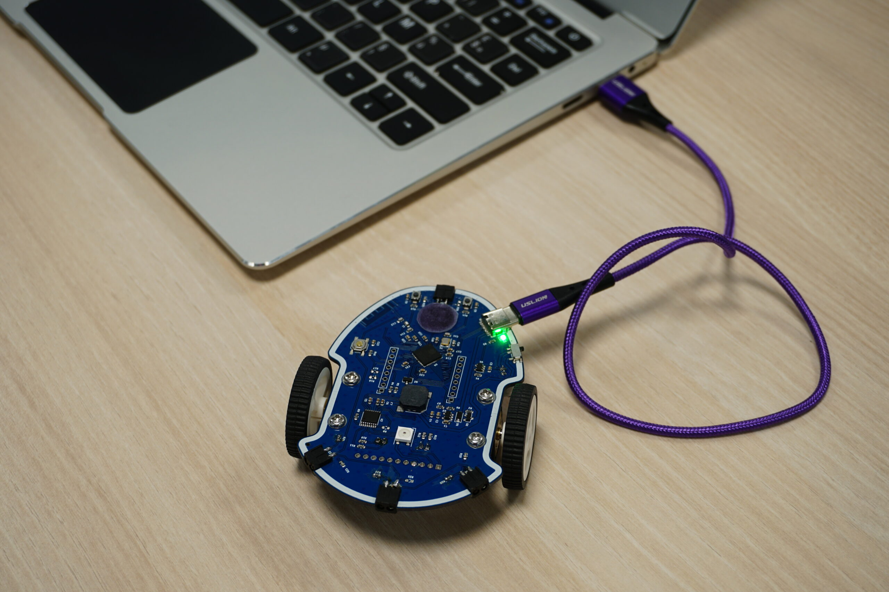

### Envoi du code à Eliobot

Pour tester ton programme sur Eliobot, il suffit de cliquer sur « Programmer »

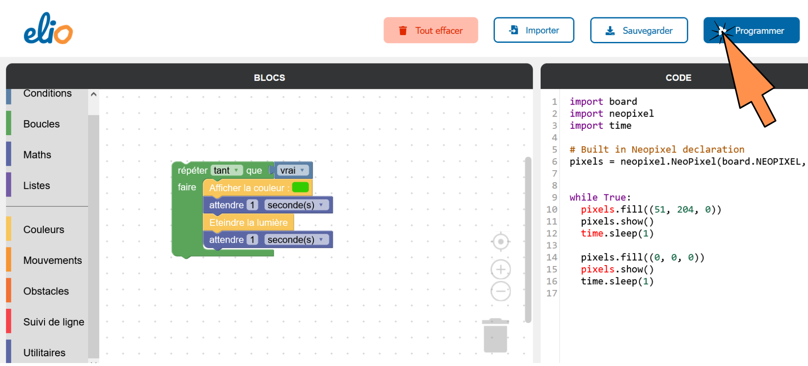

Une fenêtre s’ouvre, demandant l’accès à un port série, on séléctionne « Eliobot » ou dans certains cas « CircuitPython », puis sur « Connexion »

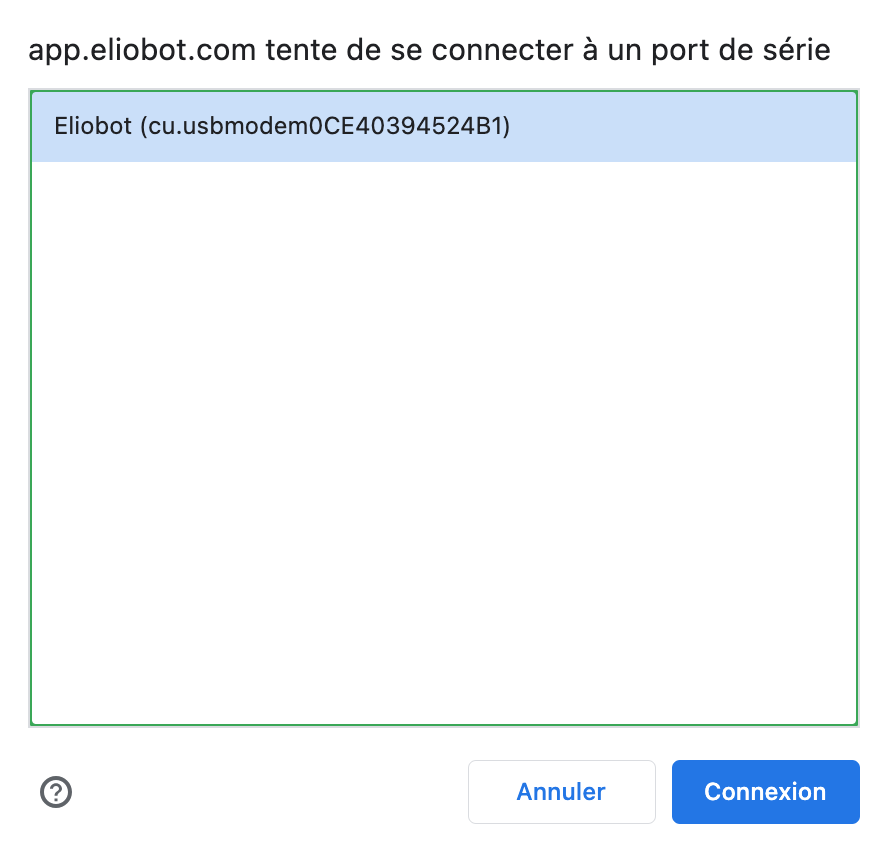

Eliobot va alors redémarrer puis clignoter en violet puis jaune, ça y est il est programmé !

### Réalisation du programme

Le programme est désormais transmis à ton Eliobot. Allume-le et admire le travail. Qu’observes-tu ?

Une lumière verte (ou de la couleur que tu as choisie) clignote alors sur ton robot ! 🙂

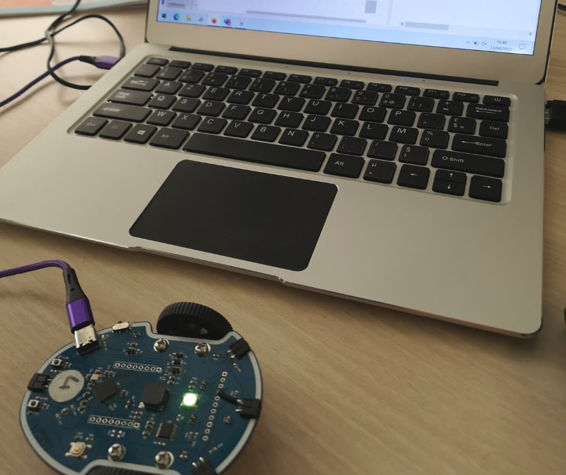

Félicitation pour ce nouveau pas en programmation. Prochaine étape, challenger Eliobot en le faisant se déplacer 🙂 Es-tu prêt à relever ce nouveau défi ?

Pense à partager votre expérience sur nos réseaux sociaux. Nous nous ferons un plaisir de partager tes créations et d’échanger avec toi.

À très vite 🙂
