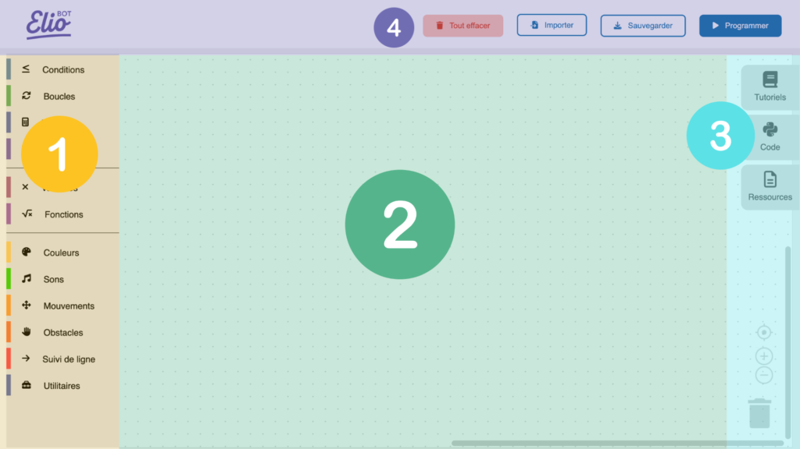
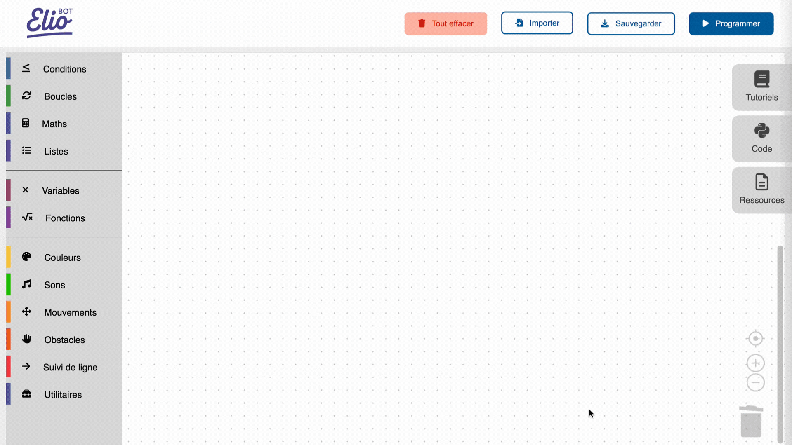
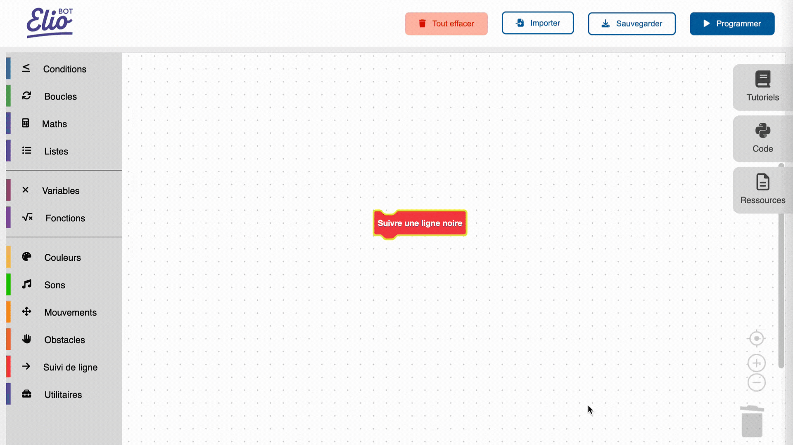
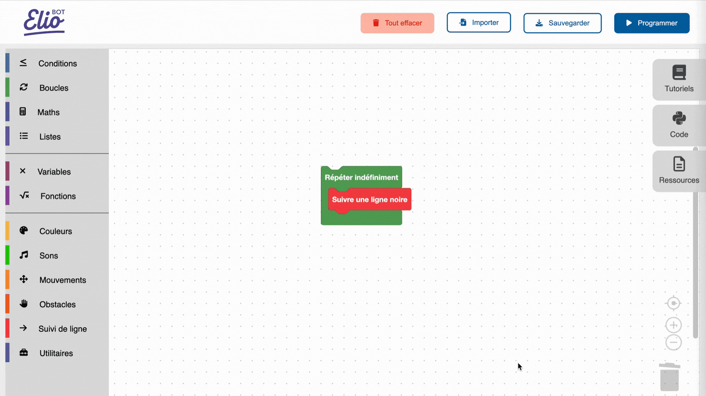

# Premier programme

Maintenant que tu as assemblé ton Eliobot, tu vas pouvoir le programmer !

Dans ce tutoriel, nous allons te guider pour créer ton premier programme. Il s’agit d’un programme de test très simple qui te permettra de prendre en main l’interface et de suivre la ligne au dos de ta notice.

À tes blocs 🙂

### Étape 1 : Découverte de l’interface

#### Comprendre l’interface

Voici comment se compose l’interface. Cette partie d’explication te servira pour la suite du tutoriel.

> 1. La boîte à outils (l’espace où tu retrouveras l’ensemble des blocs nécessaires pour la programmation).
> 
> 2. L’espace de travail (c'est où tu pourras assembler tes blocs).
> 
> 3. Les onglets te permettant d'accéder aux tutoriels, de l'aide, ainsi que voir le code qui va s'écrire quand tu poses des blocs.
>     
> 4. Les boutons :
>    - Tout effacer : pour nettoyer ton espace de travail en un seul clic.
>    - Importer : ouvre un programme précédemment enregistré.
>    - Sauvegarder : sauvegarde ton programme sur ton ordinateur.
>    - Programmer : pour envoyer le code à Eliobot.

### Étape 2 : Création du premier programme

Ce programme « test » te permettra de suivre la ligne qui se trouve au dos de la notice d’assemblage de Eliobot.

#### A. Sélection de la ligne

La première étape consiste à sélectionner une ligne. Va dans ta boîte à outils et cliquez sur le bloc « Suivi de ligne ». Sélectionne le bloc « Suivre une ligne noire » et glisse-le dans ton espace de travail.

#### B. Création d’une boucle

Cette étape consiste à créer une boucle afin que Eliobot suive la ligne tout le temps (c’est un outil très pratique que l’on va utiliser souvent)

Clique sur la catégorie « Boucles » puis prends le bloc « Répéter indéfiniment ». Glisse-le autour des blocs déjà présents.

### Étape 3 : La programmation du robot

#### A. Branchement de Eliobot

C’est le moment de brancher ton robot Eliobot à l’aide du câble USB si ce n’est pas encore fait.

> Tu peux voir une petite LED s’allumer juste à côté de la prise pour t’indiquer que Eliobot recharge sa batterie.

#### B. Téléchargement du code

Envoie ton programme à Eliobot en cliquant sur le bouton « Programmer » en haut à droite.

> Tu peux aussi sauvegarder tes blocs pour les utiliser plus tard grâce au bouton « Sauvegarder ».

#### C. Exécution du programme

Le programme est désormais envoyé à Eliobot. Allume-le, pose le sur la ligne noire au dos de la notice et admirez le faire des tours en suivant la ligne !

Félicitations pour ce premier pas vers la programmation. Prochaine étape, faire clignoter Eliobot de toutes les couleurs !

Pense à partager ton expérience sur nos réseaux sociaux. Nous nous ferons un plaisir de partager tes créations et d’échanger avec toi.

À très vite 🙂