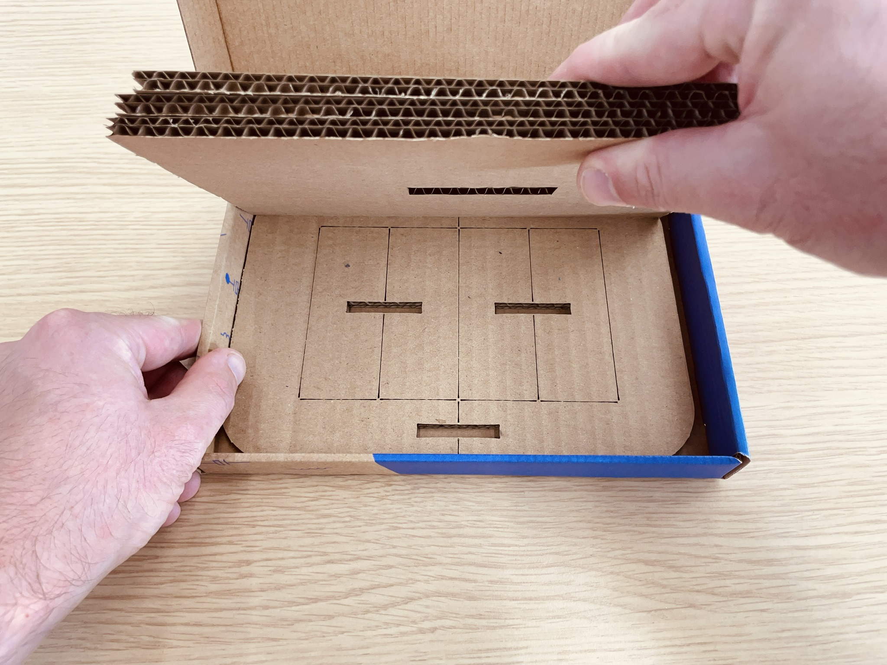
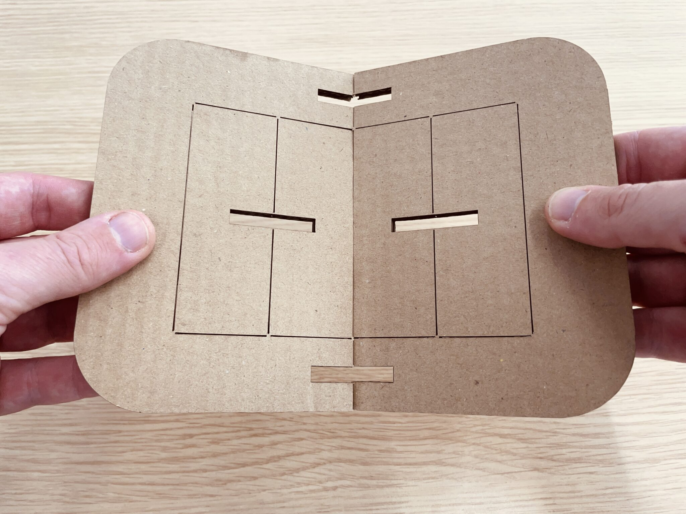
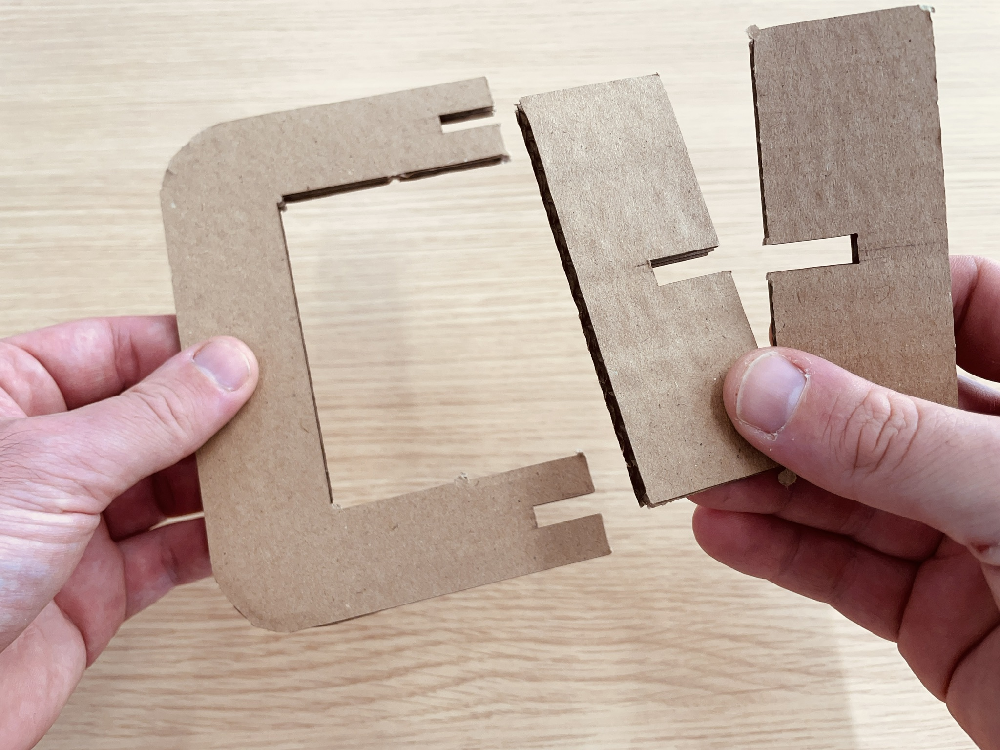
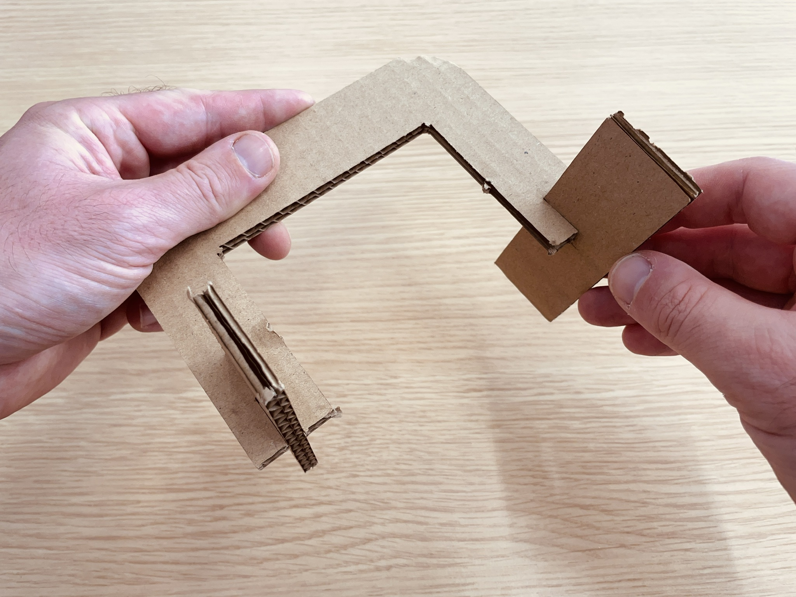
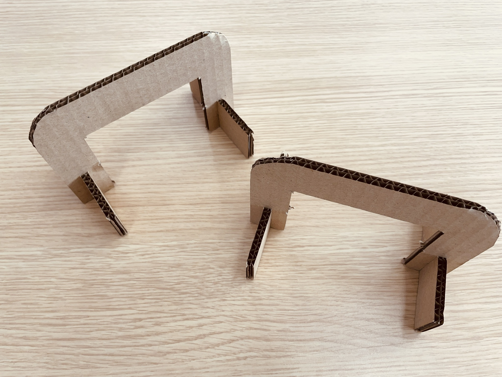

# Construire des obstacles

Ca y est ton robot est assemblé ? Et si je te disais qu’il restait peut être encore une surprise au fond de ta boite !

Soulève les plaques de carton du dessus pour trouver une dernière plaque avec les coins arrondis au fond du carton.

Prends cette plaque et sépare-la en deux.

Puis détache les deux éléments au centre de chaque demie plaque, ce sont les pieds.
L’autre élément en forme de « U » est la porte

Assemble les pieds sur la porte

Et voila ! Tu viens de créer deux petites portes dans lesquelles Eliobot pourra circuler.

Tu peux également en profiter pour personnaliser tes obstacles

Découvre comment programmer Eliobot pour qu’il passe a travers ces portes dans les tutoriels suivants.

Tu peux également venir faire un tour sur le serveur discord Eliobot pour partager tes projets et échanger avec d’autres membres : https://discord.gg/abq2t9vdMN