# Ajouter le capteur de ligne

> :memo: **Note**   
Cette mise à jour concerne uniquement les robots Eliobot commercialisés avant le 1er Aout 2023. 
Après cette date la mise à jour est déjà faite lors de la production.

Tous les robots Eliobot sont prévus pour accueillir un capteur de ligne, mais les premiers lots n’en étaient pas équipés. Dans ce cas il est possible de faire la demande du capteur [à cette adresse](https://forms.gle/Y3mQPfNaEa1iAnsq5).

Dans ce tutoriel nous allons t’expliquer comment équiper Eliobot de ce nouveau capteur.

Tu auras besoin du matériel suivant :

- Ton robot Eliobot
- Le capteur de ligne
- La prise du capteur de ligne
- Le support d’assemblage
- Un fer à souder
- De l’étain
- Un tournevis

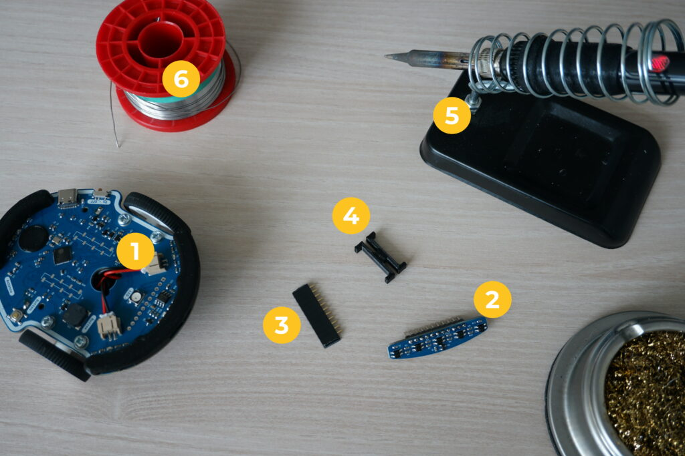

Les Eliobots nécessitant cette opération sont uniquement ceux n’ayant pas là prise dessous à l’avant. Si la prise est déjà présente il ne te reste plus qu’à brancher le capteur en mettant la partie arrondie vers l’avant.

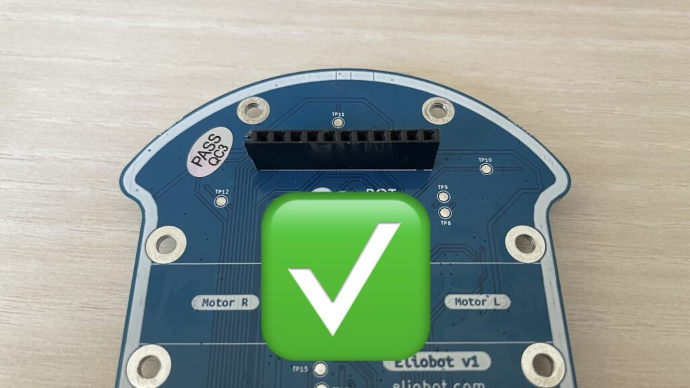

Dans ce cas, Eliobot est déjà équipé pour recevoir le capteur.

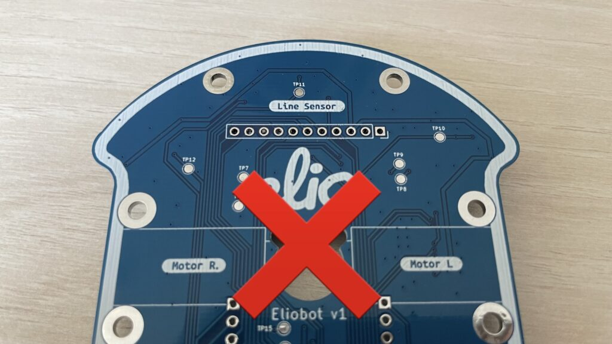

Dans ce cas, suis attentivement ce tutoriel pour ajouter le suivi de ligne.

## Préparation

Avant de commencer la soudure, il faut un peu préparer Eliobot.

On commence par retirer la batterie pour éviter tout risque en cas de mauvaise manipulation.

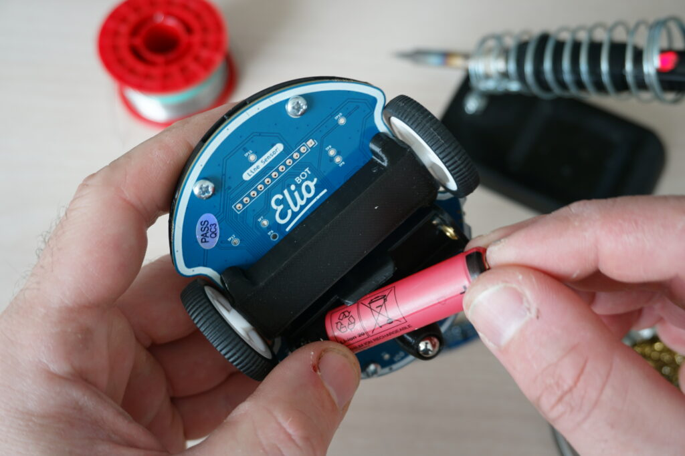

On démonte ensuite le bumper avant.

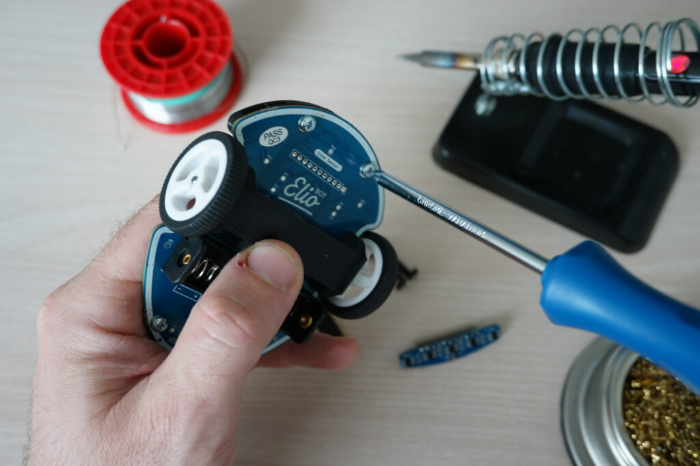

Puis on glisse le support d’assemblage sur la prise du capteur.

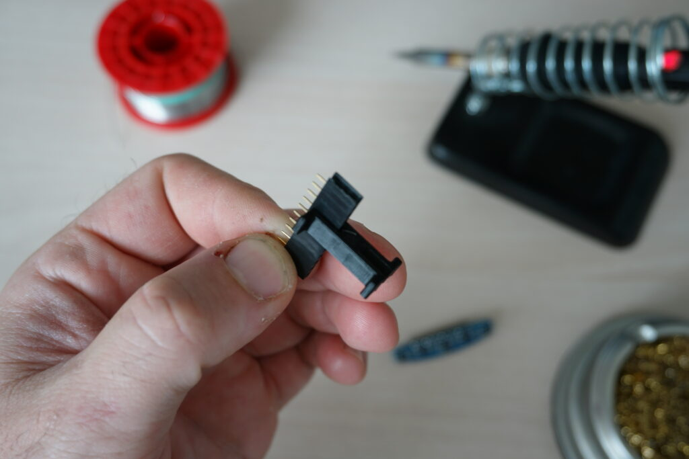

Enfin on insert la prise dans la rangée de trous et pose Eliobot à l’endroit sur la table. Il est important de vérifier que toutes les broches de la prise dépassent de la carte électronique.

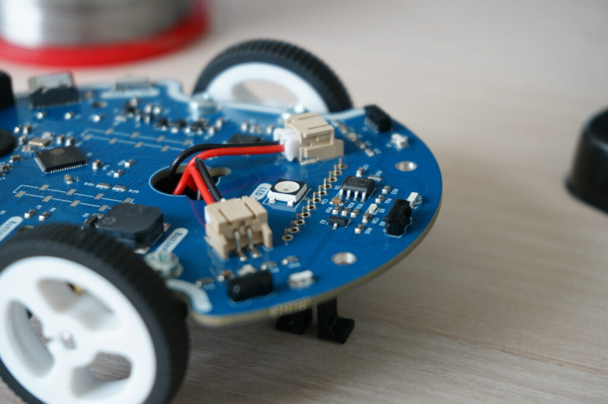

Eliobot est prêt ? C’est parti pour la soudure ! 😎

## La soudure

> :warning: **Attention** :warning:  
La soudure nécessite de manipuler un fer à souder, qui peut provoquer des brûlures en cas de mauvaise utilisation.

C’est le moment de mettre le fer à souder à chauffer aux alentours de 350°C. Une fois chaud, on dépose un peu d’étain sur la pointe du fer pour faciliter la soudure.

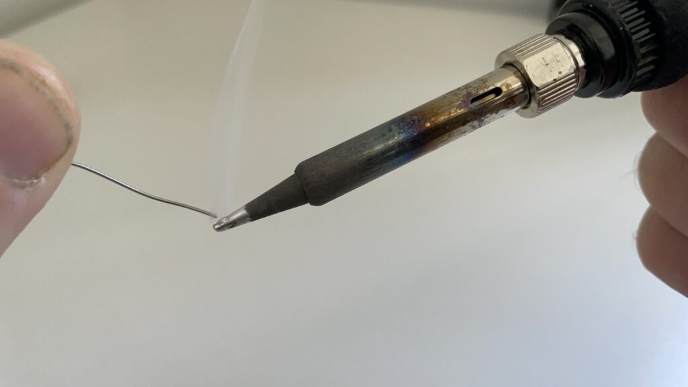

Pour souder les broches traversantes, on pose la pointe du fer (1) en même temps sur la pastille (2) et la broche (3) et laisse chauffer pendant 1 seconde. On dépose ensuite un peu d’étain (4) pour former un cône de soudure autours de la broche et de la pastille.

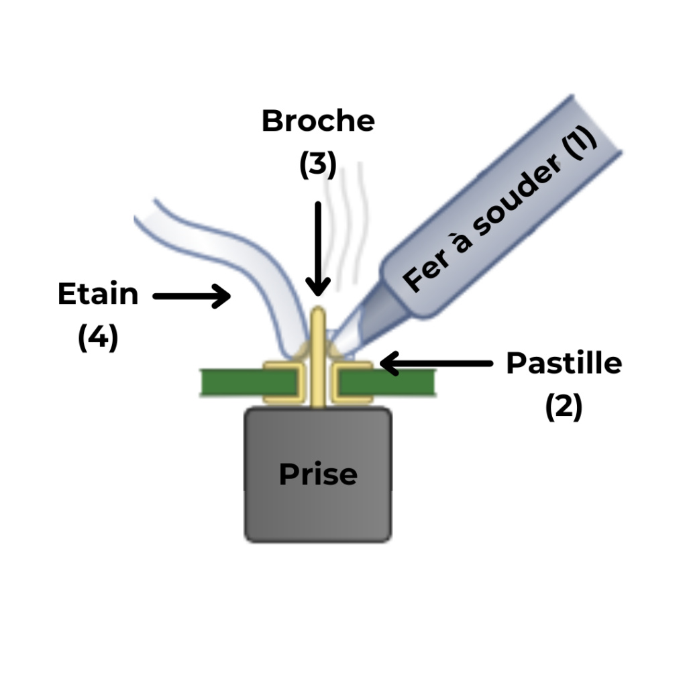

Une fois le cône formé on retire le fer, attend quelques secondes que la soudure prenne, puis passe à la broche suivante.

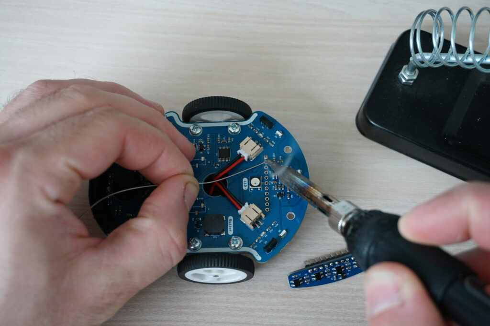

Voici à quoi doivent ressembler les soudures une fois finies. L’étain forme un cône brillant et continu autour de la broche et de la pastille.

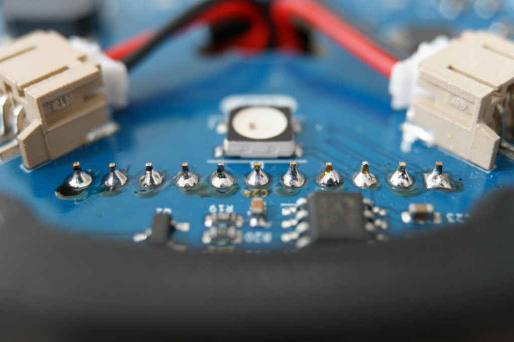

## Le remontage

Bravo, tu viens de réaliser tes premières soudures !
On va maintenant pour finir l’assemblage de Eliobot.

On commence par connecter le capteur de ligne dans la prise que l’on vient de souder.

:warning: Attention au sens : La partie arrondie du capteur va vers l’avant. :warning:

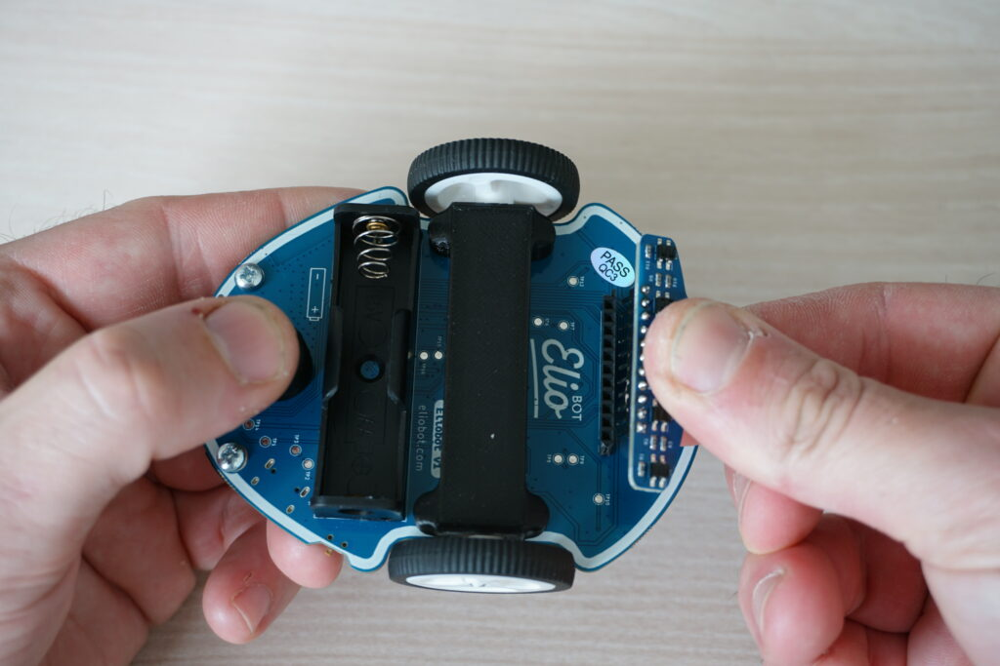

On peut ensuite remonter le bumper avant.

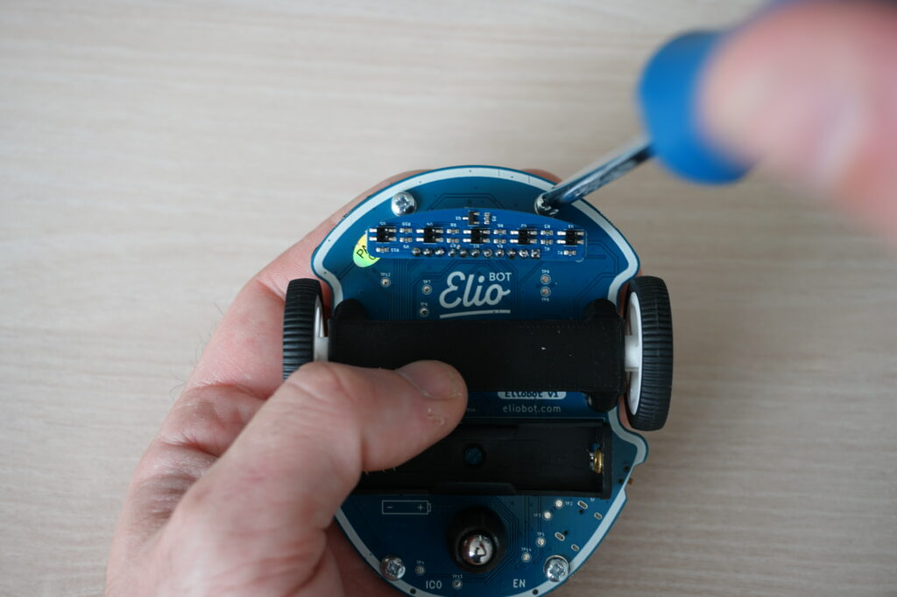

Et enfin, on remet la batterie en respectant le (+) et le (-)

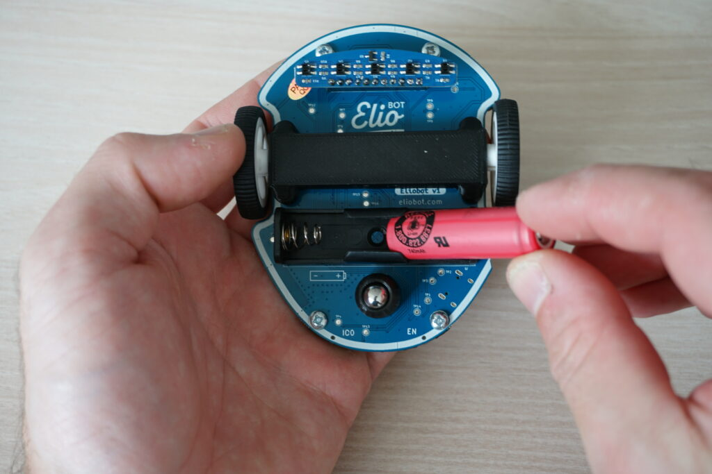

Et voila, Eliobot vient de gagner un nouveau capteur, ainsi que plein de nouvelles capacités qui vont avec ! 😍

Il va notamment pouvoir suivre une ligne, on t’explique tout ça dans ce tutoriel :
