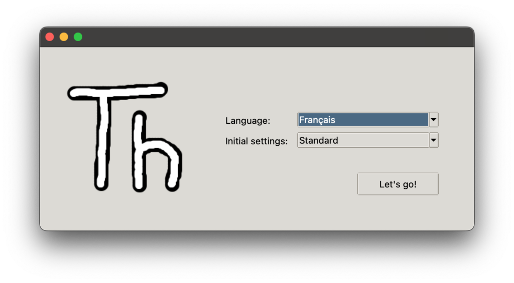
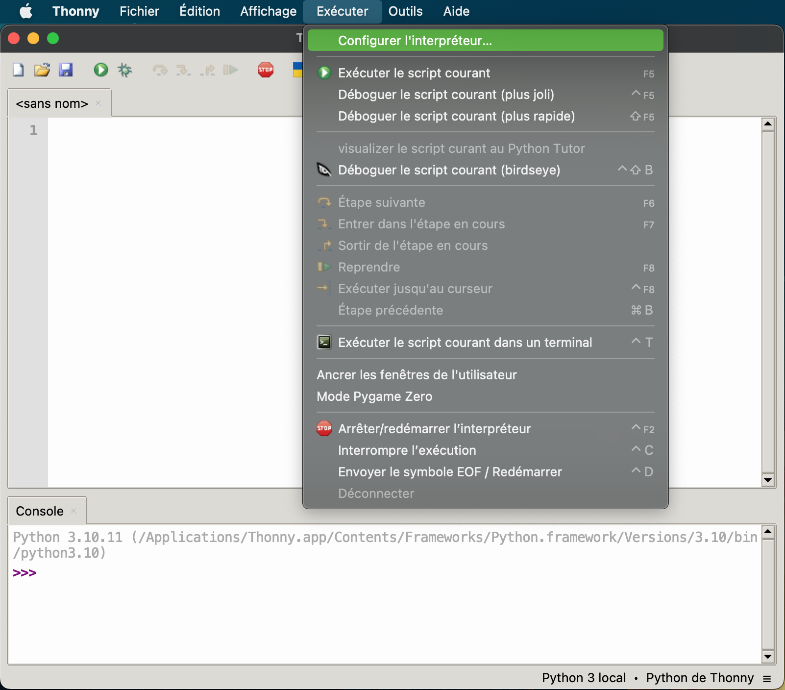
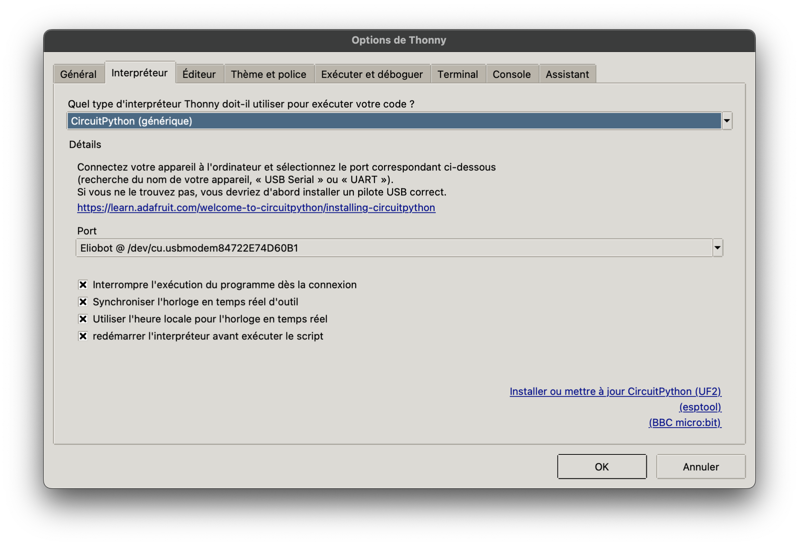
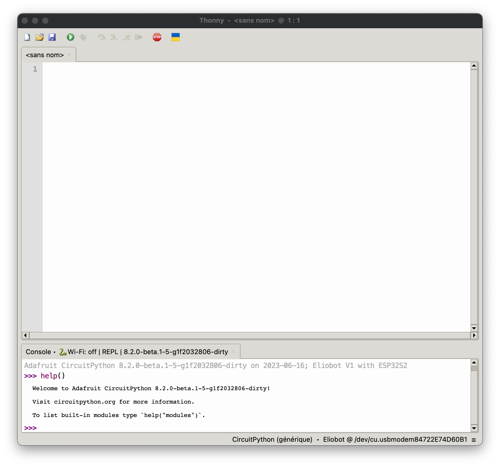
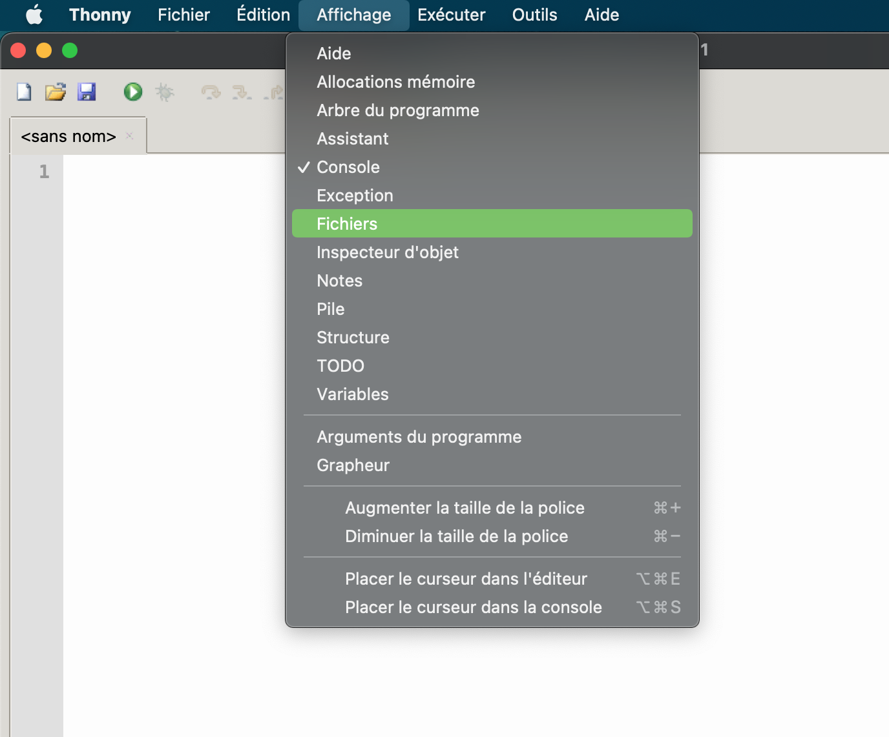
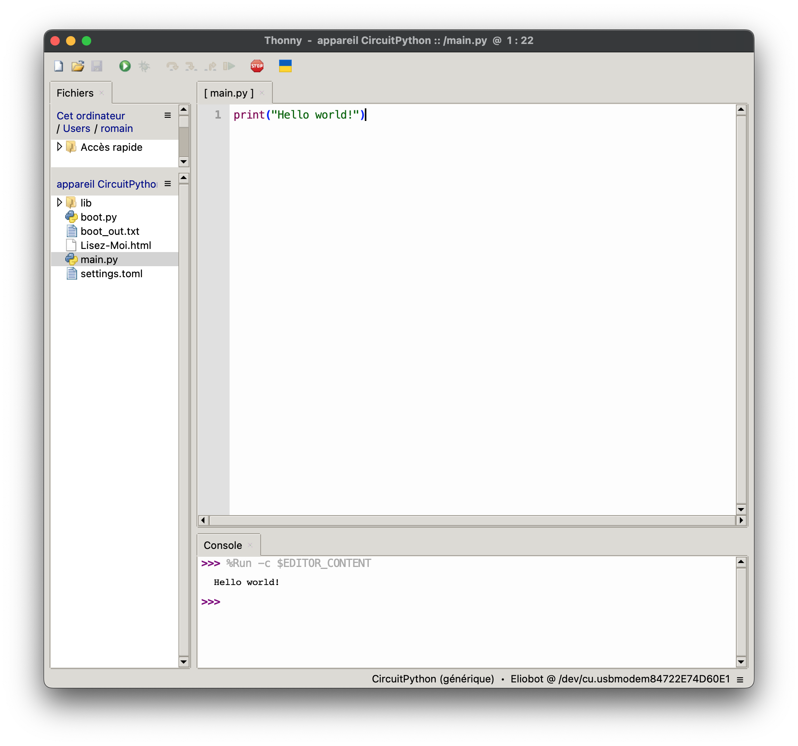

# Configuration de Python

La première étape pour te lancer dans la programmation est de configurer un environnement de développement (on parle d’un IDE en anglais). Celui que l’on te propose s’appelle Thonny et est disponible juste ici : https://thonny.org/

Une fois que tu as téléchargé et installé la version qui correspond à ton ordinateur, nous allons configurer Thonny pour qu’il soit compatible avec Eliobot.

Lors du premier lancement Thonny te demande de choisir ta langue, tu peux alors choisir “Français” puis cliquer sur “Let’s go!”

Maintenant que Thonny est lancé, nous allons y connecter Eliobot. Branche Eliobot à ton ordinateur à l’aide du câble USB, puis tout en haut de la fenêtre cliques sur “Exécuter” puis “Configurer l’interpréteur”.

Tu arrives alors sur une fenêtre avec deux menus déroulants qu’il faudra configurer comme ci-dessous. Le premier te demande le type d’interpréteur, dans notre cas il s’agit de “CircuitPython”. Le deuxième te demande de sélectionner le port auquel se connecter, sélectionne alors “Eliobot”.

Il arrive que le port soit reconnu comme “CircuitPython” sous Windows, on utilisera celui-ci dans ce cas.

Après avoir cliqué sur “OK” la LED de Eliobot s’allume en blanc ce qui veut dire qu’il est bien connecté. Pour vérifier la connexion on peut lui envoyer la commande “help()” dans la console en bas, il doit alors nous répondre le message suivant :

Une dernière étape pour rendre l’interface plus agréable consiste à afficher le contenu de Eliobot. Pour ça rends-toi toi en haut dans “Affichage” puis “Fichiers”

Tu peux voir qu’une nouvelle colonne vient d’apparaitre à gauche.

En dessous de “appareil CircuitPython” c’est tous les fichiers contenus dans ton Eliobot.

Tu trouveras notamment le fichier “main.py”, le programme principal et qui contient tout le code du dernier programme que tu as envoyé à Eliobot. L’extension “.py” signifie que c’est un fichier écrit en Python.

On va justement ouvrir le fichier “main.py” pour créer notre programme.
Un des exemples courant consiste à afficher le message “Hello world!” et dans notre cas on utilisera la commande “print()” pour l’afficher dans la console.

Notre programme tient en une seule ligne : print(“Hello world!”)

Pour voir le message s’afficher, il ne nous reste plus qu’à exécuter le programme en cliquant sur le bouton vers avec la fleche ▶️.

Tu devrais obtenir le résultat suivant :

Et voila, tu viens de créer ta première commande en Python pour Eliobot !

Dans l’exemple suivant nous allons voir ensemble comment construire un programme qui n’a pas besoin de l’ordinateur pour fonctionner.